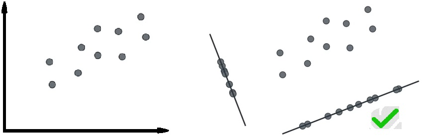
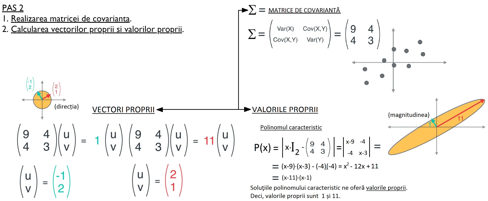
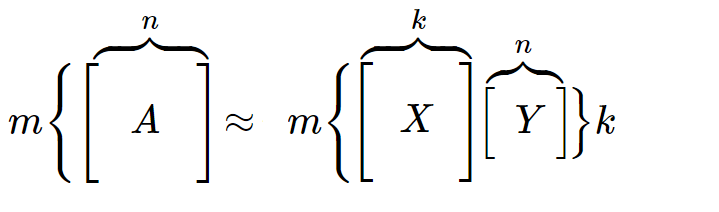
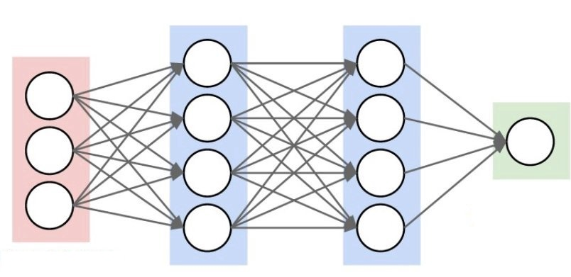
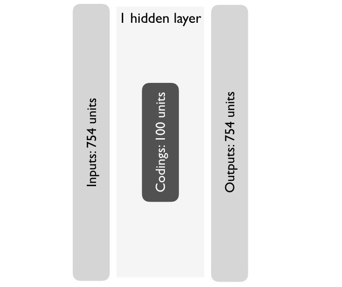
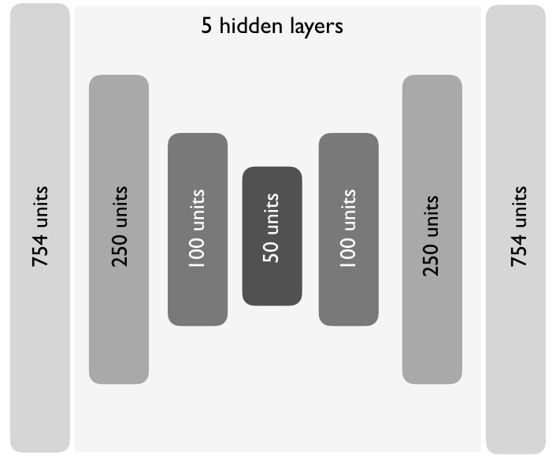
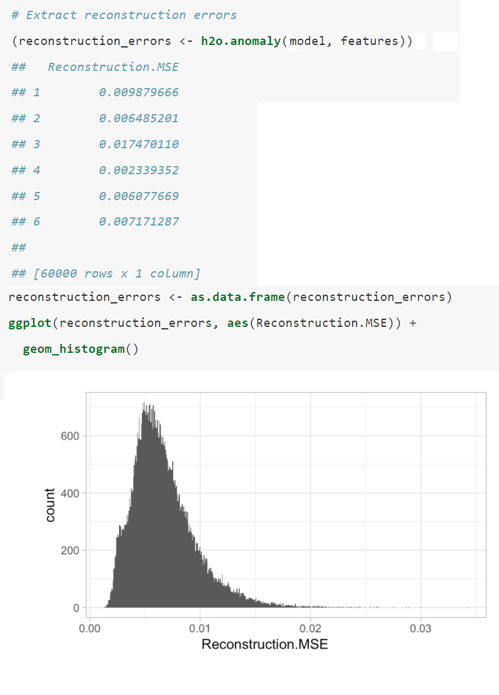

```{r setup, include=FALSE}
knitr::opts_chunk$set(echo = TRUE)
```

## PCA, GLRM şi Autoencoders 

- Analiza componentelor principale 
  - Descriere generală
  - Determinarea componentelor principale
  - Etapele realizării PCA
- Modele generate de rang scăzut
  - Descriere generală
  - Determinarea rangurilor scăzute
  - Potrivirea modelelor generate de rang scăzut în R
- Codificatoare automate
  - Descrierea generală
  - Realizarea unui codificator automat
  - Tipuri de arhitecturi   
    - Codificatoare automate incomplete
    - Codificatoare automate rare 
    - Codificatoare automate denoising
  
# Analiza componentelor principale  
  
Analiza componentelor principale ( Principal Component Analysis ) este o metoda de a găsi reprezentările de mici dimensiuni ale seturilor de date care rețin pe cât de mult posibil din variația originală. Ideea este că fiecare dintre cele n observații se află în spațiul p-dimensional, unde nu toate dimensiunile sunt la fel de interesante. În PCA căutăm un număr cât mai mic de dimensiuni care să fie cât mai interesante. Acest concept de interesant este măsurat prin cantitatea în care observațiile variază de-a lungul fiecărei dimensiuni. Fiecare dintre noile dimensiuni găsite în PCA este o combinație liniară a observațiilor inițiale în p-dimensional. Speranța este de a folosi un mic set de date ale acestor combinații ale caracteristicilor lineare în analize ulterioare, păstrând în acelați timp majoritatea informațiilor prezente în datele originale. Metodele de reducere a dimensiunii cum ar fi PCA, se concentrează pe reducerea spațiului de caracteristici, permițând   majorității informațiilor sau variației in setul de date să fie explicate folosind puține caracteristici. În cazul PCA, aceste caracteristici vor fi necorelate. 

## DETERMINAREA COMPONENTELOR PRINCIPALE 

 Prima componentă principală a setului caracteristici $X_{1},X_{2}, ...,X_{p}$ este o combinație liniară a caracteristicilor 
 $$  \hspace{110pt} Z_{1} = \phi_{11}X_{1} + \phi_{21}X_{2} + ... +\phi_{p1}X_{p}  \hspace{110pt} (1)  $$ care are varianţa cea mai mare. În acest caz, vom considera 
 $\phi_{1}$ = $( \phi_{11} , \phi_{21},...,\phi_{p1} )$  ca fiind vectorul de încărcare pentru prima componentă principală. Luând în considerare că vectorii $\phi$ sunt normalizaţi, atunci conform definiţiei ştim că $\sum_{j=1}^{p} \phi_{j1}^{2}$  = 1 


După ce prima componentă principală $Z_{1}$ a fost determinată, putem să găsim a doua componentă principală $Z_{2}$. A doua componentă principală este o combinaţie liniară a $X_{1},X_{2}, ...,X_{p}$ care are variaţia maximală din toate combinaţiile liniare care nu sunt corelate cu $Z_{1}$:
 $$  \hspace{110pt} Z_{2} = \phi_{12}X_{1} + \phi_{22}X_{2} + ... +\phi_{p2}X_{p}  \hspace{110pt} (2)  $$ unde de asemenea  vom defini $\phi_{2}$ = $( \phi_{12} , \phi_{22},...,\phi_{p2} )$  ca fiind vectorul de încărcare pentru a doua  componentă principală. Acest proces continuă până când toate p componente principale sunt calculate.

<div style="text-align:center;margin-top:0px;margin-right:0px"></div>

 Etapele realizării PCA 

<div style="text-align:center;margin-top:0px;margin-right:0px;"></div>


## PAS 1 
 
 1. Stabilirea setului de date. 
 2. Centrarea și scalarea datelor

<div style="text-align:center;margin-top:0px;"></div>

Pentru a aplica tehnicile de reducere a dimensiunii în R, datele trebuie să fie filtrate prin următorii paşi: 
 1. Setul de date trebuie să fie într-un format ordonat ( <a href="https://drive.google.com/file/d/1fFv2hfI2OGRkged6URML3h2k06CIN6kk/view?usp=sharing" target="_blank">detalii</a> ).
 2. Oricare valoarea lipsă în setul de date trebuie să fie stearsă  sau introdusă.
 3. Datele trebuie să fie toate valori numerice ( de exemplu observaţie, etichetă, caracteristică categorică cu o codificare ordinală ) .
 4. Datele numerice ar trebui să fie standardizate ( de exemplu centrate şi scalate) pentru a face observaţiile comparabile. </p>

```{r,message = FALSE,warning = FALSE,echo= TRUE}
setwd("C:/Users/Gabi/Desktop/Metode de reducere a dimensiunii/Proiect DM")
teeth <- read.csv("teeth.csv", header=TRUE)
tee <-teeth[,1:10]
teethpcx <- tee
head(teethpcx) # vom afișa câteva observații
teethpc<-teeth[,2:9] # selectăm doar datele pe care o să le folosim      
#summary(teethpc)
```

```{r,message = FALSE,warning = FALSE,echo= TRUE}
# Quick display of two cabapilities of GGally, to assess the distribution and correlation of variables 
library(GGally)
library(ggplot2) 
# Create data 
data <- data.frame(teethpc) 
# Check correlations (as scatterplots), distribution and print corrleation coefficient 
ggpairs(data, title=" ") 
# Quick display of two cabapilities of GGally, to assess the distribution and correlation of variables 
library(GGally)
#cor(teethpc) 
# Nice visualization of correlations
ggcorr(teethpc) 
```

<div style="text-align:center;margin-top:0px;margin-left:0px;"></div>

## Matricea de covarianță

```{r,message = FALSE,warning = FALSE,echo=TRUE}
library(knitr)
library(cluster.datasets)
teethpc <- scale(teethpc)
kable( round( cov(teethpc[,1:8]),2))
```

```{r,message = FALSE,warning = FALSE,echo=TRUE}
library(reshape)
library(gridExtra)
library(gdata)
library(ggplot2)

pc.teeth <- princomp(teethpc, cor=TRUE, scale= TRUE)
#note one problem with R is that the method works even when the code is
#not exactly correct pc.teeth <- princomp(teethpc, scale=TRUE, center=TRUE)
#produces results but they are wrong
#names() tells you what information is available from the output
#names(pc.teeth)
#pc.teeth
# summarize the pca   - note the std devs are divided by n not n-1
# makes them the square root of the eigenvalue
#summary(pc.teeth) # Proportion of variance = sd ^2 / number of components.
# cumultive proportion explains total variance.
```

```{r,message = FALSE,warning = FALSE,echo=TRUE}
# do things a bit better
eigenvectors<-pc.teeth$loadings
eigenvalues <- pc.teeth$sdev*pc.teeth$sdev 

# loading is the eigenvector.
#pc.teeth$loadings    # note that these are scaled so the sum of squares is 1.0
# not loadings but eigenvectors
#eigenvectors #These are the principal components that determine the directions of the new feature space
```

## Valorile proprii

```{r,message = FALSE,warning = FALSE,echo=TRUE}                 
# Eigenvalues determine the magnitude
ev <- data.frame(round(eigenvalues,2))
knitr::kable(
  ev,
  col.names = c('valoare proprie'))

```

```{r,message = FALSE,warning = FALSE,echo=TRUE}                 
# Eigenvalues determine the magnitude
#vt <- round(eigenvectors,2)
#knitr::kable(
#  vt,
# col.names = c('vec proprie'))
eigenvectors

pc.fit <- prcomp(~  top.incisor +bottom.incisor +   top.cannine +   bot.cannine   +  top.premol +
                   botpremol   +     topmolar  + botmolar,
                 data=teeth,   scale=TRUE     )
eigenvalues <- pc.fit$sdev * pc.fit$sdev
eigenvectors <- pc.fit$rotation
eigenvalues
round(eigenvectors,2)
```

## Vectori proprii

```{r,message = FALSE,warning = FALSE,echo=TRUE}                 
#round(eigenvectors,2)
tr <- data.frame(round(eigenvectors,2))
knitr::kable(tr,col.names = c('1-vector','2-vector','3-vector','4-vector','5-vector','6-vector','7-vector','8-vector') )
```


```{r,message = FALSE,warning = FALSE,echo=TRUE}                 

# obtain the correlations with the variables
# Based on 2 Principal components (a new coordinate system and orthogonal to each other)
# the observations are then projected onto the coordinate plane.
# For more than 1 Principal Component, the score is
#cor(teeth[,2:9], pc.teeth$scores)
# make things a bit nicer
#round( cor(teeth[,2:9], pc.teeth$scores) , 3)   # round the output
```

<div style="text-align:center;margin-top:0px;margin-left:0px;"></div>


```{r,message = FALSE,warning = FALSE,results='hide',echo=TRUE}
pc <- prcomp(teethpc,center=TRUE,scale. = TRUE,cor=TRUE)
attributes(pc)
pc$center
pc$scale
summary(pc)
plot(pc)
dat<- data.frame(pc$x)

# create a new plot window
#windows()
# scatterplot of scores with labels given by mammal in col 1
# type = n turns off the default symbol
plot(pc.teeth$scores[,1:2], type='n',xlab="PC1(59%)", ylab="PC2(18%)" )
points(pc.teeth$scores[,1:2],cex=0.5)   # this puts a small point at the center
text(pc.teeth$scores[,1:2],label=teeth[,1], cex=0.5) #add tname to plot
summary(pc.fit)
# third approach -------------------------------------------- #
# Another approach - fit using factor analysis function
# two factor solution   - useful for printing when p is large
library(psych)
#Factor Analysis - Principal Components Method
# Types of rotation... varimax, quartimax, promax, oblimin, simplimax, cluster
pc2 <- principal(teethpc,nfactors = 2,rotate="none")
pc2
# Prints out the Correlation matrix with the corresponding factors.
library(factoextra)
var <- get_pca_var(pc.teeth)
var
```

## Vizualizarea componentelor principale

```{r,message = FALSE,warning = FALSE,echo=TRUE}

# Check correlations (as scatterplots), distribution and print corrleation coefficient 

ggpairs(dat, title="") 

library("corrplot")
corrplot(var$cos2, is.corr=FALSE)
```


```{r,message = FALSE,warning = FALSE,echo=TRUE}

library(devtools)
install_github("vqv/ggbiplot")
library(ggbiplot)
g <- ggbiplot(pc.teeth, 
              obs.scale = 1, 
              var.scale = 1, 
              groups = pc$prcomp, 
              ellipse = FALSE, 
              circle = TRUE,
              ellipse.prob = 0.68)
g <- g + scale_color_discrete(name = '')
g <- g + theme(legend.direction = 'horizontal',
               legend.position = 'top')
print(g)


fviz_pca_ind(pc.teeth, col.ind = "cos2", 
             gradient.cols = c("#00AFBB", "#E7B800", "#FC4E07"),
             repel = TRUE # Avoid text overlapping (slow if many points)
             )


```

```{r,message = FALSE,warning = FALSE,echo=TRUE}

fviz_pca_var(pc.teeth, col.var = "cos2",
             gradient.cols = c("#00AFBB", "#E7B800", "#FC4E07"), 
             repel = TRUE # Avoid text overlapping
             )


fviz_pca_var(pc.teeth, col.var = "black")

```

## Selectarea numărului de componente principale

Selectarea componentelor principale se poate realiza prin două criterii în funcție de necesitate.
  1. Criteriul valorilor proprii
  2. Criteriul varianţei componentelor

 La baza acestor criterii, se află grafice scree plot. Cele mai multe grafice de acest fel arată în general asemănătoare ca formă. Acestea încep din partea stânga şi se îndreaptă cu rapiditate în jos aplatizându-se la un moment dat. Acest lucru se datorează faptului că prima componentă explică de obicei o mare parte din  varianță. Următoarele câteva componente explică o cantitate moderată, iar ultimele componente explică doar o mică parte din varianța globală. Scree plot-ul caută "cotul" în curbă şi selectează toate componentele chiar înainte ca linia să se aplatizeze.  

```{r,message = FALSE,warning = FALSE,echo=TRUE}
#fg <-data.matrix(pc.teeth)
#plot(pc.teeth$loadings)  
```

## Criteriul valorilor proprii

Valorile proprii vor varia începând cu valori mai mari ca 1 până la aproape 0. Suma valorilor proprii este egală cu numărul de variabile.
 

```{r,message = FALSE,warning = FALSE,echo=TRUE}
install.packages("factoextra")
library(factoextra)
pcaDat <- get_pca(pc.teeth)
fviz_pca_biplot(pc.teeth, label = "var")
fviz_pca_var(pc.teeth)
#abline(1,0,col='purple',lty=2) #horizontal line at 1
fviz_screeplot(pc.teeth,hjust=, addlabels = TRUE, choice = "variance")
#abline(1,0,col='purple',lty=2) #horizontal line at 1
```

```{r,message = FALSE,warning = FALSE,echo=TRUE}
fviz_screeplot(pc.teeth, addlabels = TRUE, choice = "eigenvalue")
plot(eigenvalues,main="Selectarea componentelor",ylab="valoare proprie",xlab="componenta",type="b",col="blue")
#abline(1,0,col='purple',lty=3) #horizontal line at 1
abline(h=1, col="red")
```

```{r,message = FALSE,warning = FALSE,echo=TRUE}
plot(pc)
abline(1,0,col='purple',lty=2) #horizontal line at 1
screeplot(pc.teeth,type='l',main='Selectarea componentelor principale')
abline(1,0,col='purple',lty=2) #horizontal line at 1

```

```{r,message = FALSE,warning = FALSE,echo=TRUE}
# scree plot  - note the default is a barchart
# Scree plot is a line plot of Principal Components vs Variances
# Helps deteremine the number of factors to keep.
# This method is critized for its subjectivity because you are essentially looking
# for an 'elbow' within the graph. The graph can have many 'elbows'
plot(pc.teeth)
screeplot(pc.teeth,type='l',main='Varianta componentelor principale') 
#screeplot with dots and lines
#abline(1,0,col='red',lty=2) #horizontal line at 1
```

## Criteriul varianţei componentelor

```{r,message = FALSE,warning = FALSE,echo=TRUE}
fviz_screeplot(pc.teeth, addlabels = TRUE, choice = "variance")
#plot(pc$loadings,main="Selectarea componentelor",ylab="varianţa",xlab="componenta",type="b",col="blue",xlim)
#abline(1,0,col='purple',lty=3) #horizontal line at 1
#abline(h=1, col="red")

plot(pc,main="Selectarea componentelor",xlab="componenta",type="b",col="#56f096")
abline(h=1,col="red") #horizontal line at 1
#g <-fviz_screeplot(pc.teeth,addlabels = TRUE,ylim = c(0, 70),barfill = "black",barcolor = "green",linecolor = "red",) 
#plot(g)
```

## Proiectarea datelor într-un spaţiu mai mic

```{r,message = FALSE,warning = FALSE,echo=TRUE}
# scatterplot of scores with labels given by mammal in col 1
#  type=n turns off the default symbol
plot(pc.teeth$scores[,1:2], type='n',xlab="PC1(59%)", ylab="PC2(18%)" )
points(pc.teeth$scores[,1:2],cex=0.5)   # this puts a small point at the center
#text(pc.teeth$scores[,1:2],label=teeth[,1], cex=0.5) #add tname to plot	
plot(pc.teeth$scores[,1:2], type='n',xlab="PC1(59%)", ylab="PC2(18%)" )
points(pc.teeth$scores[,1:2],cex=0.5)   # this puts a small point at the center
text(pc.teeth$scores[,1:2],label=teeth[,1], cex=0.5) #add tname to plot	
```

## GLRM

## DESCRIERE GENERALA

Modelele generalizate de rang scăzut(GLRM) reprezintă o modalitate de reducere a dimensiunii unui set de date prin realizarea unei reprezentări vectoriale condensate pentru fiecare linie și coloană din setul de date original. Liniile și coloanele condensate din matricele X și Y le vom numi implicit arhietipuri, deoarece sunt o reprezentare a caracteristicilor și observațiilor originale.

<div style="text-align:center;margin-top:0px;margin-left:0px;"></div>

## Modele generalizate de rang scăzut

  Etapele realizării unui GLRM 
  
 1. Stabilirea setului de date. 
 
 2. Alegrea rangului k 
 
 3. Funcţia de pierdere. 
 
 4. Funcțiile de regularizare 
 
 5. Determinarea parametrilor optimi 
 
 6. Vizualizarea arhietipurilor. 
 
 7. Reconstructia datelor de intrare 

 PAS 1. 

Stabilirea setului de date 

```{r message=TRUE, warning=FALSE}
library(palmerpenguins)
data(package = 'palmerpenguins')
```

```{r message=TRUE, warning=FALSE,echo=FALSE}
data<-data.frame(penguins[,3:6])
dates<-data.frame(penguins[,1:8])
head(penguins[,1:8])

```

Vizualizarea relației dintre date
```{r,message = FALSE,warning = FALSE,echo= TRUE}
# Quick display of two cabapilities of GGally, to assess the distribution and correlation of variables 
library(GGally)
library(ggplot2) 
library(tidyverse)
# Create data 
data <- data.frame(data) 
# Check correlations (as scatterplots), distribution and print corrleation coefficient 
txt<- data.frame(penguins[,1])
ggpairs(txt,aes(colour = species, alpha = 0.2), lower=list(combo=wrap("facethist",  
binwidth=0.5)))

txtx<- data.frame(penguins[,2])
ggpairs(txtx,aes(colour = island, alpha = 0.2), lower=list(combo=wrap("facethist",  
binwidth=0.5)))
ggpairs(data, title=" ") 
txtr<- data.frame(penguins[,7])
ggpairs(txtr,aes(colour = sex, alpha = 0.2), lower=list(combo=wrap("facethist",  
binwidth=0.3)))

```

În continuare vom utiliza pachetul h2o, recomandat pentru implementarea GLRM-urilor în R. 

```{r echo=TRUE, results='hide', warning=FALSE, error=FALSE, message=FALSE}
library(h2o) #instalarea pachetului
h2o.no_progress()  # dezactivarea barei de progres
h2o.init(max_mem_size = "5g")  # conectarea la instanța H2O
```
 
```{r echo=TRUE, results='hide', warning=FALSE, error=FALSE, message=FALSE}
# convertirea setului de date într-un obiect h2o
penguins.h2o <- as.h2o(penguins)
penguins.h2o
```

 PAS 2. 
Selectarea lui k
 
```{r message=TRUE, warning=FALSE}

basic_glrm <- h2o.glrm(
  training_frame = penguins.h2o,
  k = 6, 
)

```
<div style="text-align:center;margin-top:0px;margin-left:0px;"></div>

 PAS 3. 
    Funcția de pierdere  

Valorile optime ale arhietipului sunt selectate pe baza minimizării unei anumite funcții de pierdere. Funcția de pierdere ar trebui să reflecte noțiunea intuitivă a ceea ce înseamnă „a se potrivi bine cu datele”. Cea mai comună funcție de pierdere este pierderea pătratică. 

```{r message=TRUE, warning=FALSE,echo=TRUE}

basic_glrm <- h2o.glrm(
  training_frame = penguins.h2o,
  k = 6, 
  loss = "Quadratic",
)

```

```{r message=TRUE, warning=FALSE,echo=TRUE}

basic_glrm1 <- h2o.glrm(
  training_frame = penguins.h2o,
  k = 6, 
  loss = "Quadratic",
  gamma_x = 0.5,
  gamma_y = 0.5,
  max_iterations = 1500,
  recover_svd = TRUE,
  init = "SVD",
  transform = "STANDARDIZE"
)

basic_glrm2 <- h2o.glrm(
  training_frame = penguins.h2o,
  k = 6, 
  loss = "Huber",
  gamma_x = 0.5,
  gamma_y = 0.5,
  max_iterations = 1500,
  recover_svd = TRUE,
  init = "SVD",
  transform = "STANDARDIZE"
)
plot(basic_glrm1)
title(sub = "Quadratic")
plot(basic_glrm2)
title(sub = "Huber")
```

 PAS 4.

Funcțiile de regularizare 
 
O altă componentă importantă pentru adaptarea GLRM-urilor pe care ar trebui să o luăm în considerare este regularizarea. Chiar și atunci când ne concentrăm pe reducerea dimensiunii, aplicarea regularizării matricei X poate încă îmbunătăți performanța. În consecință, este o bună practică să comparăm diferite abordări.

```{r message=TRUE, warning=FALSE,echo=TRUE}

basic_glrm1 <- h2o.glrm(
  training_frame = penguins.h2o,
  k = 6, 
  loss = "Quadratic",
  gamma_x = 0.5,
  gamma_y = 0.5,
  max_iterations = 1500,
  regularization_x = "None", #tip de regulator aplicat matricei X
  regularization_y = "None", #tip de regulator aplicat matricei Y
  recover_svd = TRUE,
  init = "SVD",
  transform = "STANDARDIZE"
)

basic_glrm2 <- h2o.glrm(
  training_frame = penguins.h2o,
  k = 6, 
  loss = "Quadratic",
  gamma_x = 0.5,
  gamma_y = 0.5,
  max_iterations = 1500,
  regularization_x = "NonNegative", #tip de regulator aplicat matricei X
  regularization_y = "NonNegative", #tip de regulator aplicat matricei Y
  recover_svd = TRUE,
  init = "SVD",
  transform = "STANDARDIZE"
)


```

```{r message=TRUE, warning=FALSE,echo=TRUE}
basic_glrm <- h2o.glrm(
  training_frame = penguins.h2o,
  k = 6, 
  loss = "Quadratic",
  regularization_x = "None", #tip de regulator aplicat matricei X
  regularization_y = "None", #tip de regulator aplicat matricei Y
)

```

```{r message=TRUE, warning=FALSE,echo=TRUE}

summary(basic_glrm1)
```

```{r message=TRUE, warning=FALSE,echo=TRUE}
basic_glrm_1 <- h2o.glrm(
  training_frame = penguins.h2o,
  k = 6, 
  loss = "Quadratic",
  regularization_x = "NonNegative", #tip de regulator aplicat matricei X
  regularization_y = "NonNegative", #tip de regulator aplicat matricei Y
)
```

```{r message=TRUE, warning=FALSE,echo=TRUE}

summary(basic_glrm2)

```

 PAS 5.
  Determinarea parametrilor optimi 
  
```{r message=TRUE, warning=FALSE,echo=TRUE}

# rularea modelului implicit GLMR

basic_glrm <- h2o.glrm(
  training_frame = penguins.h2o,
  k = 6, 
  loss = "Quadratic",
  regularization_x = "None", 
  regularization_y = "None", 
  transform = "STANDARDIZE", 
  max_iterations = 2000,
  seed = 123
)

```

```{r,message = TRUE,warning = FALSE,echo=TRUE}
# Viualizarea primelor informații ale modelului
summary(basic_glrm)
```

 PAS 6.

 Vizualizarea arhietipurilor 

```{r,message = TRUE,warning = FALSE,echo=TRUE}
# Vizualizarea arhietipurilor
p<-t(basic_glrm@model$archetypes)
p
```

```{r,message = TRUE,warning = FALSE,echo=TRUE}
p1 <- t(basic_glrm@model$archetypes) %>% 
  as.data.frame() %>% 
  mutate(feature = row.names(.)) %>%
  ggplot(aes(Arch1, reorder(feature, Arch1))) +
  geom_point()
plot(p1)
```

```{r,message = TRUE,warning = FALSE,echo=TRUE}
p2 <- t(basic_glrm@model$archetypes) %>% 
  as.data.frame() %>% 
  mutate(feature = row.names(.)) %>%
  ggplot(aes(Arch1, Arch2, label = feature)) +
  geom_text()
plot(p2)
``` 

 PAS 7.
Reconstruirea datelor initiale

```{r,message = TRUE,warning = FALSE,echo=TRUE}

my_reconstruction <- h2o.reconstruct(basic_glrm,penguins.h2o, reverse_transform = TRUE)

# Raw predicted values
head(data.frame(penguins))
head(my_reconstruction)

perf <- h2o.performance(basic_glrm)
perf
basic_glrm

```
 
## Codificatoare automate 

<div style="text-align:center;margin-top:0px;"></div>

Codificatoarele automate sunt modele de deep learning feedforward. Ele vin cu toate beneficiile şi flexibilitatea pe care le oferă modelele de deep learning. Deși este un concept simplu, aceste caracteristici (numite codificări) pot fi utilizate pentru: 
reducerea dimensiunii. 
detectarea anomaliilor. 
modelarea generativă.

<div style="text-align:center;margin-top:0px;"></div>

Tipuri de arhitecturi

 - Codificatoare automate incomplete
 - Codificatoare automate stivă 
 - Codificatoare automate de reconstrucţie 

 Tipuri de arhitecturi

Codificatoare automate incomplete 

 Un autoencoder a cărui reprezentare internă are o dimensionalitate mai mică decât datele de intrare  este cunoscut sub numele de codificator automat incomplet.  

<div style="text-align:center;margin-top:0px;margin-left:0px;"></div>

Codificatoare automate stivă 

Codificatoarele automate sunt adesea antrenate doar cu <br> un singur strat ascuns. Adăugarea de straturi  suplimentare la un codificator automat poate avea avantaje. Adăugarea de adâncime suplimentară poate permite codificărilor să reprezinte relații mai complexe, neliniare, la un cost de calcul redus. 

<div style="text-align:center;margin-top:0px;margin-left:0px;"></div>

<div style="text-align:center;margin-top:0px;margin-left:0px;"></div>

<div style="text-align:center;margin-top:0px;margin-left:0px;"></div>

Codificatorul automat de reconstrucţie 

Codificatorul automat de reconstrucţie  este antrenat să <br> reconstruiască datele de intrare dintr-o copie coruptă a acestora. Obiectivele unui codificator automat de reconstrucție sunt codificarea intrărilor pentru a păstra caracteristicile esențiale și anularea efectelelor unui proces de corupție aplicat datelor de intrare ale codificatorului. 

<div style="text-align:center;margin-top:0px;margin-left:0px;"></div>

Etapele realizării unui codificator automat

1. Stabilirea setului de date 
2. Antrenarea codificatorului 
3. Determinarea caracteristicilor profunde(DF) 
4. Determinarea erorii de reconstrucție și reconstrucţia datelor iniţiale 

PAS 1.
 Stabilirea setului de date

```{r,message = FALSE,echo=FALSE,warning = FALSE,echo=TRUE}
#Pachetele pentru modelare
library(h2o)
library(dplyr)      #  pentru manipularea datelor
library(ggplot2)    # pentru vizualizarea datelor
# pentru montarea autoencoderelor
h2o.init()
# Import the USArrests dataset into H2O:
arrests <- h2o.importFile("https://s3.amazonaws.com/h2o-public-test-data/smalldata/pca_test/USArrests.csv")
```

```{r,message = FALSE,warning = FALSE}
arrests
#names(arrests)
```

```{r message=TRUE, warning=FALSE,echo=FALSE}
data<-data.matrix(arrests[,1:4])
#head(date)
```

Vizualizarea relației dintre date

```{r,message = FALSE,warning = FALSE,echo=TRUE}
# Quick display of two cabapilities of GGally, to assess the distribution and correlation of variables 
library(GGally)
library(ggplot2) 
# Create data 
data <- data.frame(data) 
# Check correlations (as scatterplots), distribution and print corrleation coefficient 
ggpairs(data, title=" ") 

```

```{r,message = FALSE,echo=FALSE,warning = FALSE,echo=TRUE}
h2o.no_progress() # dezactivăm barele de progres
h2o.init(max_mem_size ="5g") # ini?ializăm instan?a H2O
```

PAS 2.
 Antrenarea codificatorului

```{r,message = FALSE,warning = FALSE,echo=TRUE}

# Vom împărți setul de date. 
arrests_splits <- h2o.splitFrame(data = arrests, ratios = 0.8, seed = 1234)
train <- arrests_splits[[1]]
valid <- arrests_splits[[2]]
arrests_splits
```

```{r,message = FALSE,warning = FALSE,echo=TRUE}
# Convert arrests features to an h2o input data set
features <- as.h2o(train)
```

```{r,message = FALSE,warning = FALSE,echo=TRUE}

autoencoder <- h2o.deeplearning(
  x = seq_along(features),
  training_frame = features,
  autoencoder = TRUE,
  distribution='gaussian',
  loss = "Quadratic",
  hidden = 2,
  activation = 'Tanh',
  sparse = TRUE ,
  average_activation = 0.7,
  )

autoencoder
```

PAS 3.
 Determinarea caracteristicilor profunde(DF)
 
```{r,message = FALSE,warning = FALSE,echo=TRUE}
# Extract the deep features
ae1_codings <- h2o.deepfeatures(autoencoder, train, layer = 1)
ae1_codings
summary(ae1_codings)
```

PAS 4.
 Determinarea erorii de reconstrucție și reconstrucţia datelor iniţiale 
 
```{r,message = FALSE,warning = FALSE,echo=TRUE}
ae1_codings %>% 
    as.data.frame() %>% 
    tidyr::gather() %>%
    summarize(max_activation = max(value))

ae1_codings %>% 
    as.data.frame() %>% 
    tidyr::gather() %>%
    summarize(min_activation = min(value))

ae1_codings %>% 
    as.data.frame() %>% 
    tidyr::gather() %>%
    summarize(average_activation = mean(value))

perf <- h2o.performance(autoencoder)
perf

arrests
pred <- h2o.predict(autoencoder, newdata = arrests)
pred
```

## Vizualizarea reconstrucției

Cât de bine reconstituie un codificator automat datele de intrăre ? Mean Squared Error ne oferă o evaluare generală a erorilor, dar putem compara direct intrările şi ieşirile reconstruite. Figura următoare ilustrează această comparaţie prin eşantionarea unei serii de imagini de testare, prezicerea valorilor pixelilor reconstruiţi pe baza unui codificator automat optim şi reprezentarea grafică a  cifrelor originale în raport cu cifrele reconstruite. Obiectivul autoencoderului este de a capta caracteristicile proeminente ale imaginilor în care orice diferenţă ar trebui să fie neglijabilă. Figura următoare ilustrează faptul că un codificator  automat face o treabă destul de bună în acest sens.  

<div style="text-align:center;margin-top:0px;margin-left:0px;"></div>

## Comapararea PCA-ului cu un autoencoder

Un codificator automat care foloseşte numai funcţii de activare liniară şi funcţia de pierdere este MSE se poate reduce la PCA.  

<div style="text-align:center;margin-top:0px;"></div>

 Detectarea anomaliilor

Deoarece funcţia de pierdere a unui codificator automat măsoară eroare de reconstrucţie, atunci putem să extragem informaţii cu privire la identificarea acelor observaţii care au o rată foarte mare a erorii. Acele observaţii care au atribute ale caracteristicilor care diferă foarte multe de celelate caracteristici le vom considera a fi valori aberante.

<div style="text-align:center;margin-top:0px;margin-left:0px"></div>


