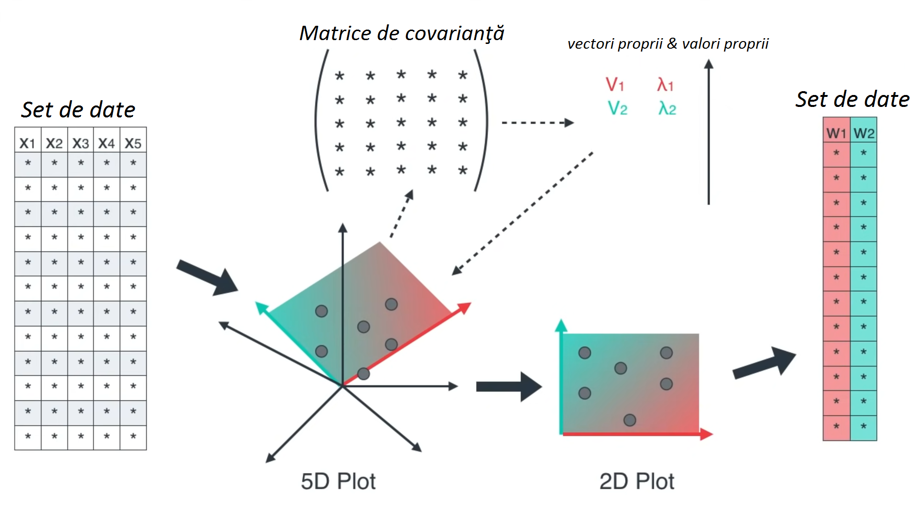
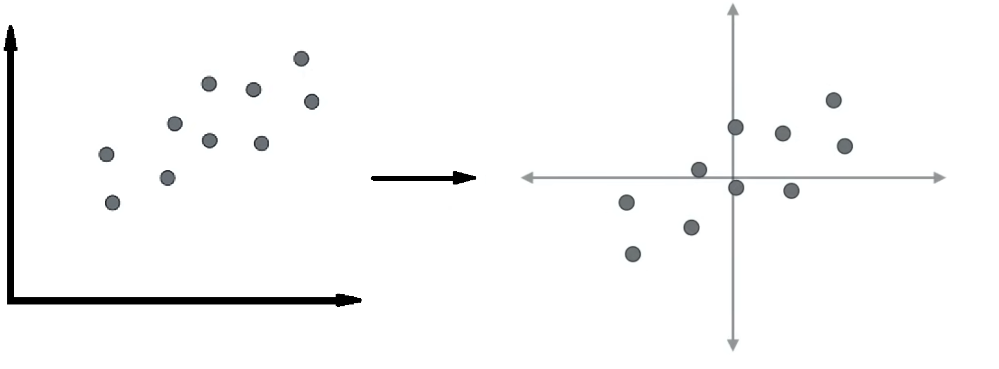
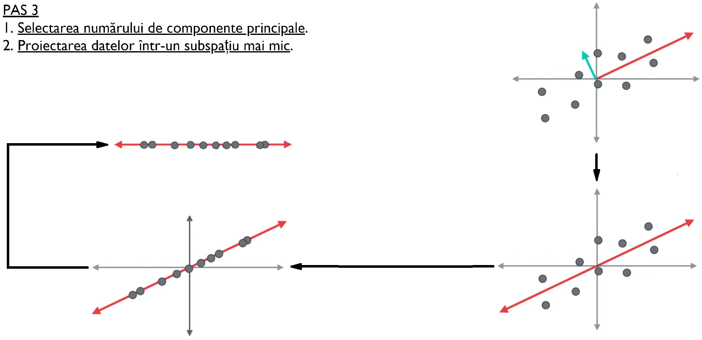

```{r setup, include=FALSE}
knitr::opts_chunk$set(echo = TRUE)
```

## Cuprins

- Analiza componentelor principale 
  - Descriere generală
  - Determinarea componentelor principale
  - Etapele realizării PCA
- Modele generate de rang scăzut
  - Descriere generală
  - Etapele realizării GLRM
- Codificatoare automate
  - Descrierea generală
  - Tipuri de arhitecturi   
    - Codificatoare automate incomplete
    - Codificatoare automate stivă 
    - Codificatoare automate de reconstrucție
  - Etapele realizării unui codificator automat

## Analiza componentelor principale

## Analiza componentelor principale

<u> DESCRIERE GENERALĂ </u>

## Analiza componentelor principale

<u> DESCRIERE GENERALĂ </u>

 <p style="font-size:20pt">&nbsp;&nbsp;<span style="text-decoration:underline">Analiza componentelor principale </span>( Principal Component Analysis ) este o metoda de a găsi reprezentările de mici dimensiuni ale seturilor de date care rețin pe cât de mult posibil din variația originală. Ideea este că fiecare dintre cele n observații se află în spațiul p-dimensional, unde nu toate dimensiunile sunt la fel de interesante. <br> &nbsp; &nbsp; În PCA căutăm un număr cât mai mic de dimensiuni care să fie cât mai interesante. Acest concept de interesant este măsurat prin cantitatea în care observațiile variază de-a lungul fiecărei dimensiuni. Fiecare dintre noile dimensiuni găsite în PCA este o combinație liniară a observațiilor inițiale în p-dimensional. Speranța este de a folosi un mic set de date ale acestor combinații ale caracteristicilor lineare în analize ulterioare, păstrând în acelați timp majoritatea informațiilor prezente în datele originale.<br>  &nbsp;&nbsp; Metodele de reducere a dimensiunii cum ar fi PCA, se concentrează pe reducerea spațiului de caracteristici, permițând   majorității informațiilor sau variației in setul de date să fie explicate folosind puține caracteristici. În cazul PCA, aceste caracteristici vor fi necorelate. </p>

## Analiza componentelor principale

<u> DETERMINAREA COMPONENTELOR PRINCIPALE </u>

 <p style="font-size:20pt"> &nbsp;&nbsp; Prima componentă principală a setului caracteristici $X_{1},X_{2}, ...,X_{p}$ este o combinație liniară a caracteristicilor 
 $$  \hspace{110pt} Z_{1} = \phi_{11}X_{1} + \phi_{21}X_{2} + ... +\phi_{p1}X_{p}  \hspace{110pt} (1)  $$ care are varianţa cea mai mare. În acest caz, vom considera 
 $\phi_{1}$ = $( \phi_{11} , \phi_{21},...,\phi_{p1} )$  ca fiind vectorul de încărcare pentru prima componentă principală. Luând în considerare că vectorii $\phi$ sunt normalizaţi, atunci conform definiţiei ştim că $\sum_{j=1}^{p} \phi_{j1}^{2}$  = 1    </p> 


 <p style="font-size:20pt"> &nbsp; &nbsp; După ce prima componentă principală $Z_{1}$ a fost determinată, putem să găsim a doua componentă principală $Z_{2}$. A doua componentă principală este o combinaţie liniară a $X_{1},X_{2}, ...,X_{p}$ care are variaţia maximală din toate combinaţiile liniare care nu sunt corelate cu $Z_{1}$:
 $$  \hspace{110pt} Z_{2} = \phi_{12}X_{1} + \phi_{22}X_{2} + ... +\phi_{p2}X_{p}  \hspace{110pt} (2)  $$ unde de asemenea  vom defini $\phi_{2}$ = $( \phi_{12} , \phi_{22},...,\phi_{p2} )$  ca fiind vectorul de încărcare pentru a doua  componentă principală. Acest proces continuă până când toate p componente principale sunt calculate.</p> 

<div style="text-align:right;margin-top:-25px;margin-right:250px"></div>

## Analiza componentelor principale 

<u> Etapele realizării PCA </u>

<div style="text-align:center;margin-top:-31px;margin-right:0px;"></div>

## Analiza componentelor principale 

  <u> PAS 1</u> <br>
 1. <u>Stabilirea setului de date</u>. <br> 2. <u>Centrarea și scalarea datelor</u>.

<div style="text-align:center;margin-top:100px;"></div>

## Analiza componentelor principale

<p style="font-size:17pt">Pentru a aplica tehnicile de reducere a dimensiunii în R, datele trebuie să fie filtrate prin următorii paşi: 
<br> &nbsp; &nbsp; 1. Setul de date trebuie să fie într-un format ordonat ( <a href="https://drive.google.com/file/d/1fFv2hfI2OGRkged6URML3h2k06CIN6kk/view?usp=sharing" target="_blank">detalii</a> ).
<br> &nbsp; &nbsp; 2. Oricare valoarea lipsă în setul de date trebuie să fie stearsă  sau introdusă.
<br> &nbsp; &nbsp; 3. Datele trebuie să fie toate valori numerice ( de exemplu observaţie, etichetă, caracteristică categorică cu o codificare ordinală ) .
<br> &nbsp; &nbsp; 4. Datele numerice ar trebui să fie standardizate ( de exemplu centrate şi scalate) pentru a face observaţiile comparabile. </p>


<div style="font-size:17pt;">
```{r,message = FALSE,warning = FALSE,echo= FALSE}
setwd("C:/Users/Gabi/Desktop/Metode de reducere a dimensiunii/Proiect DM")
teeth <- read.csv("teeth.csv", header=TRUE)
tee <-teeth[,1:10]
teethpcx <- tee
head(teethpcx) # vom afișa câteva observații
teethpc<-teeth[,2:9] # selectăm doar datele pe care o să le folosim      
#summary(teethpc)
```

<p style="font-size:25pt"><u>Vizualizarea relației dintre date</u> </p>
```{r,message = FALSE,warning = FALSE,echo= FALSE}
# Quick display of two cabapilities of GGally, to assess the distribution and correlation of variables 
library(GGally)
library(ggplot2) 
# Create data 
data <- data.frame(teethpc) 
# Check correlations (as scatterplots), distribution and print corrleation coefficient 
ggpairs(data, title=" ") 
# Quick display of two cabapilities of GGally, to assess the distribution and correlation of variables 
library(GGally)
#cor(teethpc) 
# Nice visualization of correlations
ggcorr(teethpc) 
```
</div>

## Analiza componentelor principale 

<div style="text-align:center;margin-top:0px;margin-left:-60px;"></div>

## Analiza componentelor principale 

<p style="font-size:25pt"><u>Matricea de covarianță</u></p>
<div style="font-size:13pt;">
```{r,message = FALSE,warning = FALSE,echo=FALSE}
library(knitr)
library(cluster.datasets)
teethpc <- scale(teethpc)
kable( round( cov(teethpc[,1:8]),2))
```
</div>

```{r,message = FALSE,warning = FALSE,echo=FALSE}
library(reshape)
library(gridExtra)
library(gdata)
library(ggplot2)

pc.teeth <- princomp(teethpc, cor=TRUE, scale= TRUE)
#note one problem with R is that the method works even when the code is
#not exactly correct pc.teeth <- princomp(teethpc, scale=TRUE, center=TRUE)
#produces results but they are wrong
#names() tells you what information is available from the output
#names(pc.teeth)
#pc.teeth
# summarize the pca   - note the std devs are divided by n not n-1
# makes them the square root of the eigenvalue
#summary(pc.teeth) # Proportion of variance = sd ^2 / number of components.
# cumultive proportion explains total variance.
```

```{r,message = FALSE,warning = FALSE,echo=FALSE,result=FALSE}
# do things a bit better
eigenvectors<-pc.teeth$loadings
eigenvalues <- pc.teeth$sdev*pc.teeth$sdev 

# loading is the eigenvector.
#pc.teeth$loadings    # note that these are scaled so the sum of squares is 1.0
# not loadings but eigenvectors
#eigenvectors #These are the principal components that determine the directions of the new feature space
```

<p style="font-size:25pt"><u>Valorile proprii</u></p>
<div style="font-size:15pt;">
```{r,message = FALSE,warning = FALSE,echo=FALSE}                 
# Eigenvalues determine the magnitude
ev <- data.frame(round(eigenvalues,2))
knitr::kable(
  ev,
  col.names = c('valoare proprie'))

```
</div>

```{r,message = FALSE,warning = FALSE,echo=FALSE,results='hide'}                 
# Eigenvalues determine the magnitude
#vt <- round(eigenvectors,2)
#knitr::kable(
#  vt,
# col.names = c('vec proprie'))
eigenvectors

pc.fit <- prcomp(~  top.incisor +bottom.incisor +   top.cannine +   bot.cannine   +  top.premol +
                   botpremol   +     topmolar  + botmolar,
                 data=teeth,   scale=TRUE     )
eigenvalues <- pc.fit$sdev * pc.fit$sdev
eigenvectors <- pc.fit$rotation
eigenvalues
round(eigenvectors,2)

```

<div style="margin-top:-495px;margin-left:337px;">
<p style="font-size:25pt"><u>Vectori proprii</u></p>
<div style="font-size:15pt">
```{r,message = FALSE,warning = FALSE,echo=FALSE}                 
#round(eigenvectors,2)
tr <- data.frame(round(eigenvectors,2))
knitr::kable(tr,col.names = c('1-vector','2-vector','3-vector','4-vector','5-vector','6-vector','7-vector','8-vector') )
```
</div>
</div>


```{r,message = FALSE,warning = FALSE,echo=FALSE}                 

# obtain the correlations with the variables
# Based on 2 Principal components (a new coordinate system and orthogonal to each other)
# the observations are then projected onto the coordinate plane.
# For more than 1 Principal Component, the score is
#cor(teeth[,2:9], pc.teeth$scores)
# make things a bit nicer
#round( cor(teeth[,2:9], pc.teeth$scores) , 3)   # round the output
```

## Analiza componentelor principale 


<div style="text-align:center;margin-top:0px;margin-left:-200px;"></div>

## Analiza componentelor principale

```{r,message = FALSE,warning = FALSE,results='hide',echo=FALSE,fig.show='hide'}
pc <- prcomp(teethpc,center=TRUE,scale. = TRUE,cor=TRUE)
attributes(pc)
pc$center
pc$scale
summary(pc)
plot(pc)
dat<- data.frame(pc$x)

# create a new plot window
#windows()
# scatterplot of scores with labels given by mammal in col 1
# type = n turns off the default symbol
plot(pc.teeth$scores[,1:2], type='n',xlab="PC1(59%)", ylab="PC2(18%)" )
points(pc.teeth$scores[,1:2],cex=0.5)   # this puts a small point at the center
text(pc.teeth$scores[,1:2],label=teeth[,1], cex=0.5) #add tname to plot
summary(pc.fit)
# third approach -------------------------------------------- #
# Another approach - fit using factor analysis function
# two factor solution   - useful for printing when p is large
library(psych)
#Factor Analysis - Principal Components Method
# Types of rotation... varimax, quartimax, promax, oblimin, simplimax, cluster
pc2 <- principal(teethpc,nfactors = 2,rotate="none")
pc2
# Prints out the Correlation matrix with the corresponding factors.
library(factoextra)
var <- get_pca_var(pc.teeth)
var
```

<p style="font-size:25pt"><u>Vizualizarea componentelor principale</u> </p>
```{r,message = FALSE,warning = FALSE,echo=FALSE,results='hide'}

# Check correlations (as scatterplots), distribution and print corrleation coefficient 

ggpairs(dat, title="") 

library("corrplot")
corrplot(var$cos2, is.corr=FALSE)
```


```{r,message = FALSE,warning = FALSE,echo=FALSE,results='hide'}

library(devtools)
install_github("vqv/ggbiplot")
library(ggbiplot)
g <- ggbiplot(pc.teeth, 
              obs.scale = 1, 
              var.scale = 1, 
              groups = pc$prcomp, 
              ellipse = FALSE, 
              circle = TRUE,
              ellipse.prob = 0.68)
g <- g + scale_color_discrete(name = '')
g <- g + theme(legend.direction = 'horizontal',
               legend.position = 'top')
print(g)


fviz_pca_ind(pc.teeth, col.ind = "cos2", 
             gradient.cols = c("#00AFBB", "#E7B800", "#FC4E07"),
             repel = TRUE # Avoid text overlapping (slow if many points)
             )


```


```{r,message = FALSE,warning = FALSE,echo=FALSE,results='hide'}

fviz_pca_var(pc.teeth, col.var = "cos2",
             gradient.cols = c("#00AFBB", "#E7B800", "#FC4E07"), 
             repel = TRUE # Avoid text overlapping
             )


fviz_pca_var(pc.teeth, col.var = "black")

```

## Analiza componentelor principale

<p style="font-size:25pt"><u>Selectarea numărului de componente principale</u> </p>

<p style="font-size:22pt"> &nbsp; &nbsp; Selectarea componentelor principale se poate realiza prin două criterii în funcție de necesitate. <br> 
&nbsp; &nbsp; &nbsp;  1. <u> Criteriul valorilor proprii</u>.<br>
&nbsp; &nbsp; &nbsp;  2. <u>Criteriul varianţei componentelor</u>. <br> <br>
&nbsp; &nbsp; La baza acestor criterii, se află grafice <u>scree plot</u>. Cele mai multe grafice de acest fel arată în general asemănătoare ca formă. <br>  Acestea încep din partea stânga şi se îndreaptă cu rapiditate în jos aplatizându-se la un moment dat. Acest lucru se datorează faptului că prima componentă explică de obicei o mare parte din  varianță. Următoarele câteva componente explică o cantitate moderată, iar ultimele componente explică doar o mică parte din varianța globală. Scree plot-ul caută "cotul" în curbă şi selectează toate componentele chiar înainte ca linia să se aplatizeze. </p> 


```{r,message = FALSE,warning = FALSE,echo=FALSE,results='hide'}
#fg <-data.matrix(pc.teeth)
#plot(pc.teeth$loadings)  
```


## Analiza componentelor principale 

<p style="font-size:25pt">1. <u> Criteriul valorilor proprii</u>.  </p>

<p style="font-size:22pt"> &nbsp; &nbsp; Valorile proprii vor varia începând cu valori mai mari ca 1 până la aproape 0. Suma valorilor proprii este egală cu numărul de variabile.</p>
 

```{r,message = FALSE,warning = FALSE,results='hide',echo=FALSE,fig.show='hide'}
install.packages("factoextra")
library(factoextra)
pcaDat <- get_pca(pc.teeth)
fviz_pca_biplot(pc.teeth, label = "var")
fviz_pca_var(pc.teeth)
#abline(1,0,col='purple',lty=2) #horizontal line at 1
fviz_screeplot(pc.teeth,hjust=, addlabels = TRUE, choice = "variance")
#abline(1,0,col='purple',lty=2) #horizontal line at 1
```


```{r,message = FALSE,warning = FALSE,echo=FALSE,results='hide'}
fviz_screeplot(pc.teeth, addlabels = TRUE, choice = "eigenvalue")
plot(eigenvalues,main="Selectarea componentelor",ylab="valoare proprie",xlab="componenta",type="b",col="blue")
#abline(1,0,col='purple',lty=3) #horizontal line at 1
abline(h=1, col="red")
```

```{r,message = FALSE,warning = FALSE,echo=FALSE,results='hide',fig.show='hide'}
plot(pc)
abline(1,0,col='purple',lty=2) #horizontal line at 1
screeplot(pc.teeth,type='l',main='Selectarea componentelor principale')
abline(1,0,col='purple',lty=2) #horizontal line at 1

```

```{r,message = FALSE,warning = FALSE,echo=FALSE,results='hide',fig.show='hide'}
# scree plot  - note the default is a barchart
# Scree plot is a line plot of Principal Components vs Variances
# Helps deteremine the number of factors to keep.
# This method is critized for its subjectivity because you are essentially looking
# for an 'elbow' within the graph. The graph can have many 'elbows'
plot(pc.teeth)
screeplot(pc.teeth,type='l',main='Varianta componentelor principale') 
#screeplot with dots and lines
#abline(1,0,col='red',lty=2) #horizontal line at 1
```

## Analiza componentelor principale

<p style="font-size:25pt">2. <u>Criteriul varianţei componentelor</u>.  </p>

```{r,message = FALSE,warning = FALSE,echo=FALSE,results='hide'}

fviz_screeplot(pc.teeth, addlabels = TRUE, choice = "variance")


#plot(pc$loadings,main="Selectarea componentelor",ylab="varianţa",xlab="componenta",type="b",col="blue",xlim)
#abline(1,0,col='purple',lty=3) #horizontal line at 1
#abline(h=1, col="red")


plot(pc,main="Selectarea componentelor",xlab="componenta",type="b",col="#56f096")
abline(h=1,col="red") #horizontal line at 1
#g <-fviz_screeplot(pc.teeth,addlabels = TRUE,ylim = c(0, 70),barfill = "black",barcolor = "green",linecolor = "red",) 
#plot(g)
```

## Analiza componentelor principale

<p style="font-size:25pt"><u>Proiectarea datelor într-un spaţiu mai mic</u> </p>

```{r,message = FALSE,warning = FALSE,echo=FALSE,results='hide'}
# scatterplot of scores with labels given by mammal in col 1
#  type=n turns off the default symbol
plot(pc.teeth$scores[,1:2], type='n',xlab="PC1(59%)", ylab="PC2(18%)" )
points(pc.teeth$scores[,1:2],cex=0.5)   # this puts a small point at the center
#text(pc.teeth$scores[,1:2],label=teeth[,1], cex=0.5) #add tname to plot	
plot(pc.teeth$scores[,1:2], type='n',xlab="PC1(59%)", ylab="PC2(18%)" )
points(pc.teeth$scores[,1:2],cex=0.5)   # this puts a small point at the center
text(pc.teeth$scores[,1:2],label=teeth[,1], cex=0.5) #add tname to plot	


```

<button onclick="window.location.href='prezentare_GLRM.html';" style="background-color:#03fc88;font-size:15pt;margin-top:0px;margin-left:1400px;">
      Modele generalizate <br>de rang scăzut
    </button>
