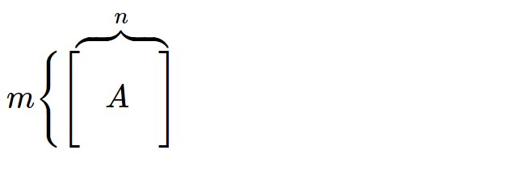
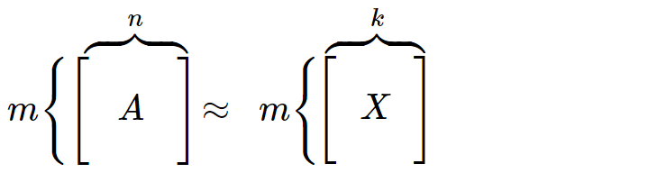
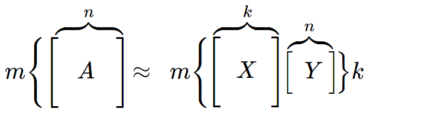
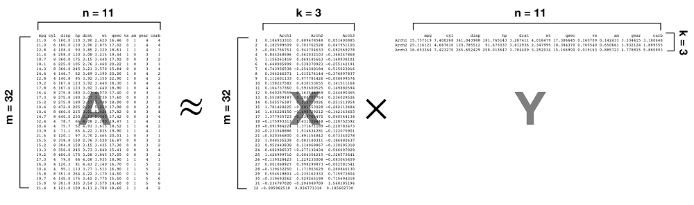

## Modele generalizate de rang scăzut

<u> DESCRIERE GENERALĂ </u>

<p style="font-size:22pt"> &nbsp; &nbsp; <u>Modelele generalizate de rang scăzut</u> (GLRM) reprezintă o modalitate de reducere a dimensiunii unui set de date prin realizarea unei reprezentări vectoriale condensate pentru fiecare linie și coloană din setul de date original. Liniile și coloanele condensate din matricele X și Y le vom numi implicit <u>arhietipuri</u>, deoarece sunt o reprezentare a caracteristicilor și observațiilor originale.</p>
 
<div style="text-align:center;margin-top:125px;margin-left:-200px;"></div>

## Modele generalizate de rang scăzut

<u> DESCRIERE GENERALĂ </u>

<p style="font-size:22pt"> &nbsp; &nbsp; <u>Modelele generalizate de rang scăzut</u> (GLRM) reprezintă o modalitate de reducere a dimensiunii unui set de date prin realizarea unei reprezentări vectoriale condensate pentru fiecare linie și coloană din setul de date original. Liniile și coloanele condensate din matricele X și Y le vom numi implicit <u>arhietipuri</u>, deoarece sunt o reprezentare a caracteristicilor și observațiilor originale.</p>
 
<div style="text-align:center;margin-top:125px;margin-left:-200px;"></div>

## Modele generalizate de rang scăzut

<u> DESCRIERE GENERALĂ </u>

<p style="font-size:22pt"> &nbsp; &nbsp; <u>Modelele generalizate de rang scăzut</u> (GLRM) reprezintă o modalitate de reducere a dimensiunii unui set de date prin realizarea unei reprezentări vectoriale condensate pentru fiecare linie și coloană din setul de date original. Liniile și coloanele condensate din matricele X și Y le vom numi implicit <u>arhietipuri</u>, deoarece sunt o reprezentare a caracteristicilor și observațiilor originale.</p>
 
<div style="text-align:center;margin-top:125px;margin-left:-200px;"></div>

## Modele generalizate de rang scăzut

 <u> Etapele realizării unui GLRM </u> <br>
 1. Stabilirea setului de date.  <br>
 2. Alegrea rangului k <br> 
 3. Funcţia de pierdere. <br> 
 4. Funcțiile de regularizare <br>
 5. Determinarea parametrilor optimi <br> 
 6. Vizualizarea arhietipurilor. <br> 
 7. Reconstructia datelor de intrare 

## Modele generalizate de rang scăzut
 
 PAS 1. <br>
 <u> Stabilirea setului de date</u> 

```{r message=TRUE, warning=FALSE}
library(palmerpenguins)
data(package = 'palmerpenguins')
```

```{r message=TRUE, warning=FALSE,echo=FALSE}
data<-data.frame(penguins[,3:6])
dates<-data.frame(penguins[,1:8])
head(penguins[,1:8])

```

<p style="font-size:25pt"><u>Vizualizarea relației dintre date</u> </p>
```{r,message = FALSE,warning = FALSE,echo= FALSE}
# Quick display of two cabapilities of GGally, to assess the distribution and correlation of variables 
library(GGally)
library(ggplot2) 
library(tidyverse)
# Create data 
data <- data.frame(data) 
# Check correlations (as scatterplots), distribution and print corrleation coefficient 
txt<- data.frame(penguins[,1])
ggpairs(txt,aes(colour = species, alpha = 0.2), lower=list(combo=wrap("facethist",  
binwidth=0.5)))

txtx<- data.frame(penguins[,2])
ggpairs(txtx,aes(colour = island, alpha = 0.2), lower=list(combo=wrap("facethist",  
binwidth=0.5)))
ggpairs(data, title=" ") 
txtr<- data.frame(penguins[,7])
ggpairs(txtr,aes(colour = sex, alpha = 0.2), lower=list(combo=wrap("facethist",  
binwidth=0.3)))

```

<p style="font-size:22pt;"> &nbsp; &nbsp; În continuare vom utiliza pachetul h2o, recomandat pentru implementarea GLRM-urilor în R. </p>

```{r echo=TRUE, results='hide', warning=FALSE, error=FALSE, message=FALSE}
library(h2o) #instalarea pachetului
h2o.no_progress()  # dezactivarea barei de progres
h2o.init(max_mem_size = "5g")  # conectarea la instanța H2O
```
 
```{r echo=TRUE, results='hide', warning=FALSE, error=FALSE, message=FALSE}
# convertirea setului de date într-un obiect h2o
penguins.h2o <- as.h2o(penguins)
penguins.h2o
```

## Modele generalizate de rang scăzut
 
 PAS 2. <br>
    <u>Selectarea lui k</u> <br>
 
```{r message=TRUE, warning=FALSE}

basic_glrm <- h2o.glrm(
  training_frame = penguins.h2o,
  k = 6, 
)

```
<div style="text-align:center;margin-top:67px;margin-left:-200px;"></div>

## Modele generalizate de rang scăzut
 
 PAS 3. <br>
    <u>Funcția de pierdere</u> <br>  
  <p style="font-size:22pt;"> &nbsp; &nbsp; Valorile optime ale arhietipului sunt selectate pe baza minimizării unei anumite funcții de pierdere. Funcția de pierdere ar trebui să reflecte noțiunea intuitivă a ceea ce înseamnă „a se potrivi bine cu datele”. Cea mai comună funcție de pierdere este pierderea pătratică. </p>

```{r message=TRUE, warning=FALSE}

basic_glrm <- h2o.glrm(
  training_frame = penguins.h2o,
  k = 6, 
  loss = "Quadratic",
)

```

```{r message=TRUE, warning=FALSE,echo=FALSE}

basic_glrm1 <- h2o.glrm(
  training_frame = penguins.h2o,
  k = 6, 
  loss = "Quadratic",
  gamma_x = 0.5,
  gamma_y = 0.5,
  max_iterations = 1500,
  recover_svd = TRUE,
  init = "SVD",
  transform = "STANDARDIZE"
)

basic_glrm2 <- h2o.glrm(
  training_frame = penguins.h2o,
  k = 6, 
  loss = "Huber",
  gamma_x = 0.5,
  gamma_y = 0.5,
  max_iterations = 1500,
  recover_svd = TRUE,
  init = "SVD",
  transform = "STANDARDIZE"
)
plot(basic_glrm1)
title(sub = "Quadratic")
plot(basic_glrm2)
title(sub = "Huber")
```


## Modele generalizate de rang scăzut
 
 PAS 4.<br>
     <u>Funcțiile de regularizare </u>
 
 
<p style="font-size:20pt;"> &nbsp; &nbsp; O altă componentă importantă pentru adaptarea GLRM-urilor pe care ar trebui să o luăm în considerare este <u>regularizarea</u>. Chiar și atunci când ne concentrăm pe reducerea dimensiunii, aplicarea regularizării matricei X poate încă îmbunătăți performanța. În consecință, este o bună practică să comparăm diferite abordări.
</p>

```{r message=TRUE, warning=FALSE,echo=FALSE}

basic_glrm1 <- h2o.glrm(
  training_frame = penguins.h2o,
  k = 6, 
  loss = "Quadratic",
  gamma_x = 0.5,
  gamma_y = 0.5,
  max_iterations = 1500,
  regularization_x = "None", #tip de regulator aplicat matricei X
  regularization_y = "None", #tip de regulator aplicat matricei Y
  recover_svd = TRUE,
  init = "SVD",
  transform = "STANDARDIZE"
)

basic_glrm2 <- h2o.glrm(
  training_frame = penguins.h2o,
  k = 6, 
  loss = "Quadratic",
  gamma_x = 0.5,
  gamma_y = 0.5,
  max_iterations = 1500,
  regularization_x = "NonNegative", #tip de regulator aplicat matricei X
  regularization_y = "NonNegative", #tip de regulator aplicat matricei Y
  recover_svd = TRUE,
  init = "SVD",
  transform = "STANDARDIZE"
)


```

```{r message=TRUE, warning=FALSE}
basic_glrm <- h2o.glrm(
  training_frame = penguins.h2o,
  k = 6, 
  loss = "Quadratic",
  regularization_x = "None", #tip de regulator aplicat matricei X
  regularization_y = "None", #tip de regulator aplicat matricei Y
)

```

```{r message=TRUE, warning=FALSE,echo=FALSE}

summary(basic_glrm1)
```

```{r message=TRUE, warning=FALSE}
basic_glrm_1 <- h2o.glrm(
  training_frame = penguins.h2o,
  k = 6, 
  loss = "Quadratic",
  regularization_x = "NonNegative", #tip de regulator aplicat matricei X
  regularization_y = "NonNegative", #tip de regulator aplicat matricei Y
)
```

```{r message=TRUE, warning=FALSE,echo=FALSE}

summary(basic_glrm2)

```

## Modele generalizate de rang scăzut
 
 PAS 5.<br>
     <u>Determinarea parametrilor optimi </u>

```{r message=TRUE, warning=FALSE}

# rularea modelului implicit GLMR

basic_glrm <- h2o.glrm(
  training_frame = penguins.h2o,
  k = 6, 
  loss = "Quadratic",
  regularization_x = "None", 
  regularization_y = "None", 
  transform = "STANDARDIZE", 
  max_iterations = 2000,
  seed = 123
)

```

```{r,message = TRUE,warning = FALSE}
# Viualizarea primelor informații ale modelului
summary(basic_glrm)
```

## Modele generalizate de rang scăzut
 
 PAS 6.<br>
     <u>Vizualizarea arhietipurilor </u>

```{r,message = TRUE,warning = FALSE}
# Vizualizarea arhietipurilor
p<-t(basic_glrm@model$archetypes)
p
```

```{r,message = TRUE,warning = FALSE}
p1 <- t(basic_glrm@model$archetypes) %>% 
  as.data.frame() %>% 
  mutate(feature = row.names(.)) %>%
  ggplot(aes(Arch1, reorder(feature, Arch1))) +
  geom_point()
plot(p1)
```

```{r,message = TRUE,warning = FALSE}
p2 <- t(basic_glrm@model$archetypes) %>% 
  as.data.frame() %>% 
  mutate(feature = row.names(.)) %>%
  ggplot(aes(Arch1, Arch2, label = feature)) +
  geom_text()
plot(p2)
``` 

## Modele generalizate de rang scăzut
 
 PAS 7.<br>
     <u>Reconstruirea datelor initiale</u>

```{r,message = TRUE,warning = FALSE}

my_reconstruction <- h2o.reconstruct(basic_glrm,penguins.h2o, reverse_transform = TRUE)

# Raw predicted values
head(data.frame(penguins))
head(my_reconstruction)

perf <- h2o.performance(basic_glrm)
perf
basic_glrm

```

<button onclick="window.location.href='prezentare_autoencoders.html';" style="background-color:#03fc88;font-size:22pt;margin-top:0px;margin-left:1400px;">
      Autoencoders
    </button>


