```{r setup, include=FALSE}
knitr::opts_chunk$set(echo = FALSE)
```

## Codificatoare automate

## Codificatoare automate

<u> DESCRIERE GENERALĂ</u>

## Codificatoare automate

<u> DESCRIERE GENERALĂ</u>

<div style="text-align:center;margin-top:60px;"></div>

## Codificatoare automate

 <u> DESCRIERE GENERALĂ</u>

<p style="font-size:20pt"><br> &nbsp;&nbsp; <u>Codificatoarele automate</u> sunt modele de deep learning feedforward. Ele vin cu toate beneficiile şi flexibilitatea pe care le oferă <br> modelele de <u>deep learning</u>. Deși este un concept simplu, aceste caracteristici (numite <u>codificări</u>) pot fi utilizate pentru: 
<br> &nbsp; &nbsp; &nbsp; &nbsp;&nbsp; &nbsp; &nbsp; &nbsp;  &nbsp; &nbsp; &nbsp; &nbsp; &nbsp; - <u>reducerea dimensiunii</u>. 
<br> &nbsp; &nbsp; &nbsp; &nbsp;&nbsp; &nbsp; &nbsp; &nbsp;  &nbsp; &nbsp; &nbsp; &nbsp; &nbsp;  - <u>detectarea anomaliilor</u>. 
<br> &nbsp; &nbsp; &nbsp; &nbsp;&nbsp; &nbsp; &nbsp; &nbsp; &nbsp; &nbsp; &nbsp; &nbsp; &nbsp; - <u>modelarea generativă</u>.
</p>

## Codificatoare automate

 <u> DESCRIERE GENERALĂ</u>

<p style="font-size:20pt">
<br> &nbsp;&nbsp; <u>Codificatoarele automate</u> sunt modele de deep learning feedforward. Ele vin cu toate beneficiile şi flexibilitatea pe care le oferă <br> modelele de <u>deep learning</u>.
Deși este un concept simplu, aceste caracteristici (numite <u>codificări</u>) pot fi utilizate pentru: 
<br> &nbsp; &nbsp; &nbsp; &nbsp;&nbsp; &nbsp; &nbsp; &nbsp;  &nbsp; &nbsp; &nbsp; &nbsp; &nbsp; - <u>reducerea dimensiunii</u>. 
<br> &nbsp; &nbsp; &nbsp; &nbsp;&nbsp; &nbsp; &nbsp; &nbsp;  &nbsp; &nbsp; &nbsp; &nbsp; &nbsp;  - <u>detectarea anomaliilor</u>. 
<br> &nbsp; &nbsp; &nbsp; &nbsp;&nbsp; &nbsp; &nbsp; &nbsp; &nbsp; &nbsp; &nbsp; &nbsp; &nbsp; - <u>modelarea generativă</u>.
</p>

<div style="text-align:center;margin-top:0px;"></div>

## Codificatoare automate

 <u> DESCRIERE GENERALĂ</u>

<p style="font-size:20pt">
<br> &nbsp;&nbsp; <u>Codificatoarele automate</u> sunt modele de deep learning feedforward. Ele vin cu toate beneficiile şi flexibilitatea pe care le oferă <br> modelele de <u>deep learning</u>.
Deși este un concept simplu, aceste caracteristici (numite <u>codificări</u>) pot fi utilizate pentru: 
<br> &nbsp; &nbsp; &nbsp; &nbsp;&nbsp; &nbsp; &nbsp; &nbsp;  &nbsp; &nbsp; &nbsp; &nbsp; &nbsp; - <u>reducerea dimensiunii</u>. 
<br> &nbsp; &nbsp; &nbsp; &nbsp;&nbsp; &nbsp; &nbsp; &nbsp;  &nbsp; &nbsp; &nbsp; &nbsp; &nbsp;  - <u>detectarea anomaliilor</u>. 
<br> &nbsp; &nbsp; &nbsp; &nbsp;&nbsp; &nbsp; &nbsp; &nbsp; &nbsp; &nbsp; &nbsp; &nbsp; &nbsp; - <u>modelarea generativă</u>.
</p>

<div style="text-align:center;margin-top:0px;">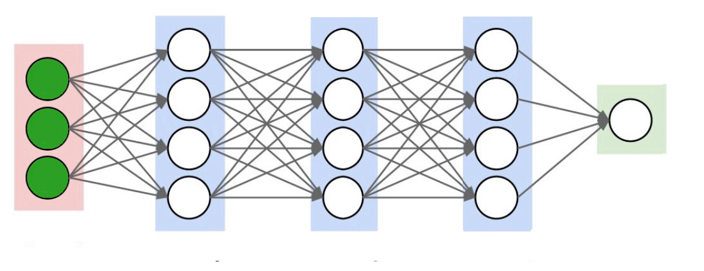</div>

## Codificatoare automate

 <u> DESCRIERE GENERALĂ</u>

<p style="font-size:20pt">
<br> &nbsp;&nbsp; <u>Codificatoarele automate</u> sunt modele de deep learning feedforward. Ele vin cu toate beneficiile şi flexibilitatea pe care le oferă <br> modelele de <u>deep learning</u>.
Deși este un concept simplu, aceste caracteristici (numite <u>codificări</u>) pot fi utilizate pentru: 
<br> &nbsp; &nbsp; &nbsp; &nbsp;&nbsp; &nbsp; &nbsp; &nbsp;  &nbsp; &nbsp; &nbsp; &nbsp; &nbsp; - <u>reducerea dimensiunii</u>. 
<br> &nbsp; &nbsp; &nbsp; &nbsp;&nbsp; &nbsp; &nbsp; &nbsp;  &nbsp; &nbsp; &nbsp; &nbsp; &nbsp;  - <u>detectarea anomaliilor</u>. 
<br> &nbsp; &nbsp; &nbsp; &nbsp;&nbsp; &nbsp; &nbsp; &nbsp; &nbsp; &nbsp; &nbsp; &nbsp; &nbsp; - <u>modelarea generativă</u>.
</p>

<div style="text-align:center;margin-top:0px;">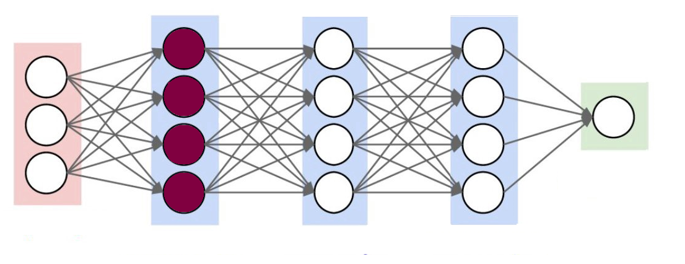</div>


## Codificatoare automate

 <u> DESCRIERE GENERALĂ</u>

<p style="font-size:20pt">
<br> &nbsp;&nbsp; <u>Codificatoarele automate</u> sunt modele de deep learning feedforward. Ele vin cu toate beneficiile şi flexibilitatea pe care le oferă <br> modelele de <u>deep learning</u>.
Deși este un concept simplu, aceste caracteristici (numite <u>codificări</u>) pot fi utilizate pentru: 
<br> &nbsp; &nbsp; &nbsp; &nbsp;&nbsp; &nbsp; &nbsp; &nbsp;  &nbsp; &nbsp; &nbsp; &nbsp; &nbsp; - <u>reducerea dimensiunii</u>. 
<br> &nbsp; &nbsp; &nbsp; &nbsp;&nbsp; &nbsp; &nbsp; &nbsp;  &nbsp; &nbsp; &nbsp; &nbsp; &nbsp;  - <u>detectarea anomaliilor</u>. 
<br> &nbsp; &nbsp; &nbsp; &nbsp;&nbsp; &nbsp; &nbsp; &nbsp; &nbsp; &nbsp; &nbsp; &nbsp; &nbsp; - <u>modelarea generativă</u>.
</p>

<div style="text-align:center;margin-top:0px;">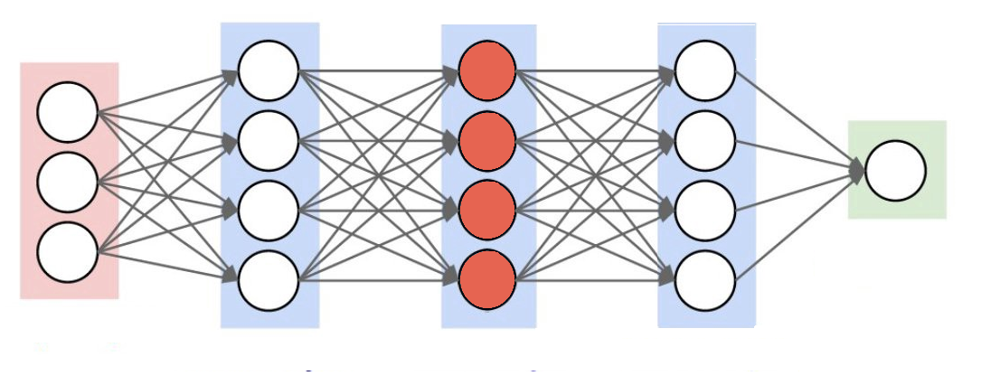</div>

## Codificatoare automate

 <u> DESCRIERE GENERALĂ</u>

<p style="font-size:20pt">
<br> &nbsp;&nbsp; <u>Codificatoarele automate</u> sunt modele de deep learning feedforward. Ele vin cu toate beneficiile şi flexibilitatea pe care le oferă <br> modelele de <u>deep learning</u>.
Deși este un concept simplu, aceste caracteristici (numite <u>codificări</u>) pot fi utilizate pentru: 
<br> &nbsp; &nbsp; &nbsp; &nbsp;&nbsp; &nbsp; &nbsp; &nbsp;  &nbsp; &nbsp; &nbsp; &nbsp; &nbsp; - <u>reducerea dimensiunii</u>. 
<br> &nbsp; &nbsp; &nbsp; &nbsp;&nbsp; &nbsp; &nbsp; &nbsp;  &nbsp; &nbsp; &nbsp; &nbsp; &nbsp;  - <u>detectarea anomaliilor</u>. 
<br> &nbsp; &nbsp; &nbsp; &nbsp;&nbsp; &nbsp; &nbsp; &nbsp; &nbsp; &nbsp; &nbsp; &nbsp; &nbsp; - <u>modelarea generativă</u>.
</p>

<div style="text-align:center;margin-top:0px;">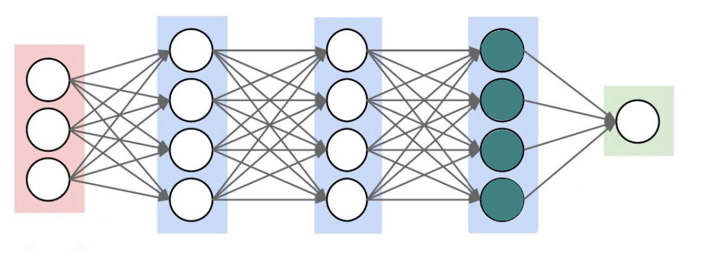</div>

## Codificatoare automate

 <u> DESCRIERE GENERALĂ</u>

<p style="font-size:20pt">
<br> &nbsp;&nbsp; <u>Codificatoarele automate</u> sunt modele de deep learning feedforward. Ele vin cu toate beneficiile şi flexibilitatea pe care le oferă <br> modelele de <u>deep learning</u>.
Deși este un concept simplu, aceste caracteristici (numite <u>codificări</u>) pot fi utilizate pentru: 
<br> &nbsp; &nbsp; &nbsp; &nbsp;&nbsp; &nbsp; &nbsp; &nbsp;  &nbsp; &nbsp; &nbsp; &nbsp; &nbsp; - <u>reducerea dimensiunii</u>. 
<br> &nbsp; &nbsp; &nbsp; &nbsp;&nbsp; &nbsp; &nbsp; &nbsp;  &nbsp; &nbsp; &nbsp; &nbsp; &nbsp;  - <u>detectarea anomaliilor</u>. 
<br> &nbsp; &nbsp; &nbsp; &nbsp;&nbsp; &nbsp; &nbsp; &nbsp; &nbsp; &nbsp; &nbsp; &nbsp; &nbsp; - <u>modelarea generativă</u>.
</p>

<div style="text-align:center;margin-top:0px;">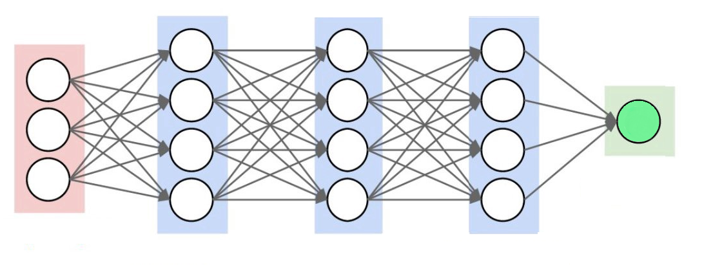</div>


## Codificatoare automate

 <u> DESCRIERE GENERALĂ</u>

<p style="font-size:20pt">
<br> &nbsp;&nbsp; <u>Codificatoarele automate</u> sunt modele de deep learning feedforward. Ele vin cu toate beneficiile şi flexibilitatea pe care le oferă <br> modelele de <u>deep learning</u>.
Deși este un concept simplu, aceste caracteristici (numite <u>codificări</u>) pot fi utilizate pentru: 
<br> &nbsp; &nbsp; &nbsp; &nbsp;&nbsp; &nbsp; &nbsp; &nbsp;  &nbsp; &nbsp; &nbsp; &nbsp; &nbsp; - <u>reducerea dimensiunii</u>. 
<br> &nbsp; &nbsp; &nbsp; &nbsp;&nbsp; &nbsp; &nbsp; &nbsp;  &nbsp; &nbsp; &nbsp; &nbsp; &nbsp;  - <u>detectarea anomaliilor</u>. 
<br> &nbsp; &nbsp; &nbsp; &nbsp;&nbsp; &nbsp; &nbsp; &nbsp; &nbsp; &nbsp; &nbsp; &nbsp; &nbsp; - <u>modelarea generativă</u>.
</p>

<div style="text-align:center;margin-top:0px;"></div>


## Codificatoare automate

 <u> DESCRIERE GENERALĂ</u>

<p style="font-size:20pt">
<br> &nbsp;&nbsp; <u>Codificatoarele automate</u> sunt modele de deep learning feedforward. Ele vin cu toate beneficiile şi flexibilitatea pe care le oferă <br> modelele de <u>deep learning</u>.
Deși este un concept simplu, aceste caracteristici (numite <u>codificări</u>) pot fi utilizate pentru: 
<br> &nbsp; &nbsp; &nbsp; &nbsp;&nbsp; &nbsp; &nbsp; &nbsp;  &nbsp; &nbsp; &nbsp; &nbsp; &nbsp; - <u>reducerea dimensiunii</u>. 
<br> &nbsp; &nbsp; &nbsp; &nbsp;&nbsp; &nbsp; &nbsp; &nbsp;  &nbsp; &nbsp; &nbsp; &nbsp; &nbsp;  - <u>detectarea anomaliilor</u>. 
<br> &nbsp; &nbsp; &nbsp; &nbsp;&nbsp; &nbsp; &nbsp; &nbsp; &nbsp; &nbsp; &nbsp; &nbsp; &nbsp; - <u>modelarea generativă</u>.
</p>

<div style="text-align:center;margin-top:0px;"></div>

## Codificatoare automate

 <u> DESCRIERE GENERALĂ</u>

<p style="font-size:20pt">
<br> &nbsp;&nbsp; <u>Codificatoarele automate</u> sunt modele de deep learning feedforward. Ele vin cu toate beneficiile şi flexibilitatea pe care le oferă <br> modelele de <u>deep learning</u>.
Deși este un concept simplu, aceste caracteristici (numite <u>codificări</u>) pot fi utilizate pentru: 
<br> &nbsp; &nbsp; &nbsp; &nbsp;&nbsp; &nbsp; &nbsp; &nbsp;  &nbsp; &nbsp; &nbsp; &nbsp; &nbsp; - <u>reducerea dimensiunii</u>. 
<br> &nbsp; &nbsp; &nbsp; &nbsp;&nbsp; &nbsp; &nbsp; &nbsp;  &nbsp; &nbsp; &nbsp; &nbsp; &nbsp;  - <u>detectarea anomaliilor</u>. 
<br> &nbsp; &nbsp; &nbsp; &nbsp;&nbsp; &nbsp; &nbsp; &nbsp; &nbsp; &nbsp; &nbsp; &nbsp; &nbsp; - <u>modelarea generativă</u>.
</p>

<div style="text-align:center;margin-top:0px;"></div>


## Codificatoare automate

 <u> DESCRIERE GENERALĂ</u>

<p style="font-size:20pt">
<br> &nbsp;&nbsp; <u>Codificatoarele automate</u> sunt modele de deep learning feedforward. Ele vin cu toate beneficiile şi flexibilitatea pe care le oferă <br> modelele de <u>deep learning</u>.
Deși este un concept simplu, aceste caracteristici (numite <u>codificări</u>) pot fi utilizate pentru: 
<br> &nbsp; &nbsp; &nbsp; &nbsp;&nbsp; &nbsp; &nbsp; &nbsp;  &nbsp; &nbsp; &nbsp; &nbsp; &nbsp; - <u>reducerea dimensiunii</u>. 
<br> &nbsp; &nbsp; &nbsp; &nbsp;&nbsp; &nbsp; &nbsp; &nbsp;  &nbsp; &nbsp; &nbsp; &nbsp; &nbsp;  - <u>detectarea anomaliilor</u>. 
<br> &nbsp; &nbsp; &nbsp; &nbsp;&nbsp; &nbsp; &nbsp; &nbsp; &nbsp; &nbsp; &nbsp; &nbsp; &nbsp; - <u>modelarea generativă</u>.
</p>

<div style="text-align:center;margin-top:0px;"></div>


## Codificatoare automate

 <u> DESCRIERE GENERALĂ</u>

<p style="font-size:20pt">
<br> &nbsp;&nbsp; <u>Codificatoarele automate</u> sunt modele de deep learning feedforward. Ele vin cu toate beneficiile şi flexibilitatea pe care le oferă <br> modelele de <u>deep learning</u>.
Deși este un concept simplu, aceste caracteristici (numite <u>codificări</u>) pot fi utilizate pentru: 
<br> &nbsp; &nbsp; &nbsp; &nbsp;&nbsp; &nbsp; &nbsp; &nbsp;  &nbsp; &nbsp; &nbsp; &nbsp; &nbsp; - <u>reducerea dimensiunii</u>. 
<br> &nbsp; &nbsp; &nbsp; &nbsp;&nbsp; &nbsp; &nbsp; &nbsp;  &nbsp; &nbsp; &nbsp; &nbsp; &nbsp;  - <u>detectarea anomaliilor</u>. 
<br> &nbsp; &nbsp; &nbsp; &nbsp;&nbsp; &nbsp; &nbsp; &nbsp; &nbsp; &nbsp; &nbsp; &nbsp; &nbsp; - <u>modelarea generativă</u>.
</p>

<div style="text-align:center;margin-top:0px;">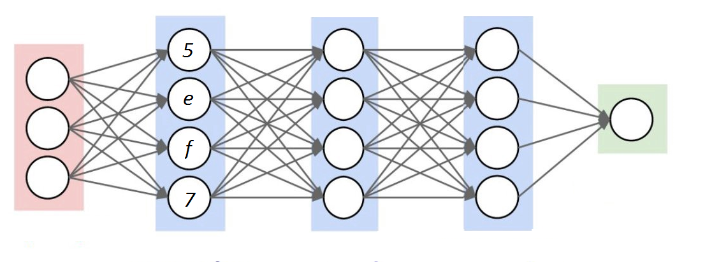</div>

## Codificatoare automate

 <u> DESCRIERE GENERALĂ</u>

<p style="font-size:20pt">
<br> &nbsp;&nbsp; <u>Codificatoarele automate</u> sunt modele de deep learning feedforward. Ele vin cu toate beneficiile şi flexibilitatea pe care le oferă <br> modelele de <u>deep learning</u>.
Deși este un concept simplu, aceste caracteristici (numite <u>codificări</u>) pot fi utilizate pentru: 
<br> &nbsp; &nbsp; &nbsp; &nbsp;&nbsp; &nbsp; &nbsp; &nbsp;  &nbsp; &nbsp; &nbsp; &nbsp; &nbsp; - <u>reducerea dimensiunii</u>. 
<br> &nbsp; &nbsp; &nbsp; &nbsp;&nbsp; &nbsp; &nbsp; &nbsp;  &nbsp; &nbsp; &nbsp; &nbsp; &nbsp;  - <u>detectarea anomaliilor</u>. 
<br> &nbsp; &nbsp; &nbsp; &nbsp;&nbsp; &nbsp; &nbsp; &nbsp; &nbsp; &nbsp; &nbsp; &nbsp; &nbsp; - <u>modelarea generativă</u>.
</p>

<div style="text-align:center;margin-top:0px;">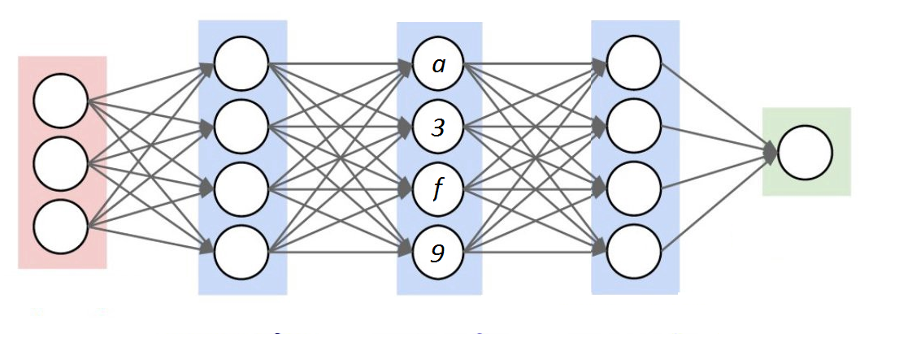</div>

## Codificatoare automate

 <u> DESCRIERE GENERALĂ</u>

<p style="font-size:20pt">
<br> &nbsp;&nbsp; <u>Codificatoarele automate</u> sunt modele de deep learning feedforward. Ele vin cu toate beneficiile şi flexibilitatea pe care le oferă <br> modelele de <u>deep learning</u>.
Deși este un concept simplu, aceste caracteristici (numite <u>codificări</u>) pot fi utilizate pentru: 
<br> &nbsp; &nbsp; &nbsp; &nbsp;&nbsp; &nbsp; &nbsp; &nbsp;  &nbsp; &nbsp; &nbsp; &nbsp; &nbsp; - <u>reducerea dimensiunii</u>. 
<br> &nbsp; &nbsp; &nbsp; &nbsp;&nbsp; &nbsp; &nbsp; &nbsp;  &nbsp; &nbsp; &nbsp; &nbsp; &nbsp;  - <u>detectarea anomaliilor</u>. 
<br> &nbsp; &nbsp; &nbsp; &nbsp;&nbsp; &nbsp; &nbsp; &nbsp; &nbsp; &nbsp; &nbsp; &nbsp; &nbsp; - <u>modelarea generativă</u>.
</p>

<div style="text-align:center;margin-top:0px;">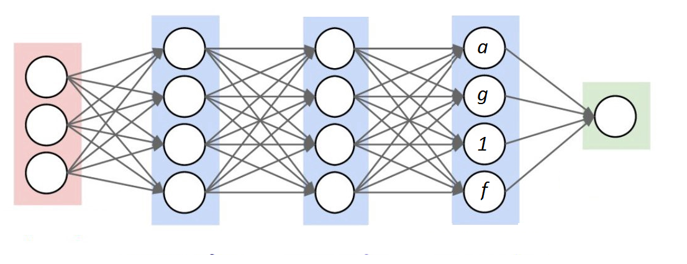</div>

## Codificatoare automate

 <u> DESCRIERE GENERALĂ</u>

<p style="font-size:20pt">
<br> &nbsp;&nbsp; <u>Codificatoarele automate</u> sunt modele de deep learning feedforward. Ele vin cu toate beneficiile şi flexibilitatea pe care le oferă <br> modelele de <u>deep learning</u>.
Deși este un concept simplu, aceste caracteristici (numite <u>codificări</u>) pot fi utilizate pentru: 
<br> &nbsp; &nbsp; &nbsp; &nbsp;&nbsp; &nbsp; &nbsp; &nbsp;  &nbsp; &nbsp; &nbsp; &nbsp; &nbsp; - <u>reducerea dimensiunii</u>. 
<br> &nbsp; &nbsp; &nbsp; &nbsp;&nbsp; &nbsp; &nbsp; &nbsp;  &nbsp; &nbsp; &nbsp; &nbsp; &nbsp;  - <u>detectarea anomaliilor</u>. 
<br> &nbsp; &nbsp; &nbsp; &nbsp;&nbsp; &nbsp; &nbsp; &nbsp; &nbsp; &nbsp; &nbsp; &nbsp; &nbsp; - <u>modelarea generativă</u>.
</p>

<div style="text-align:center;margin-top:0px;">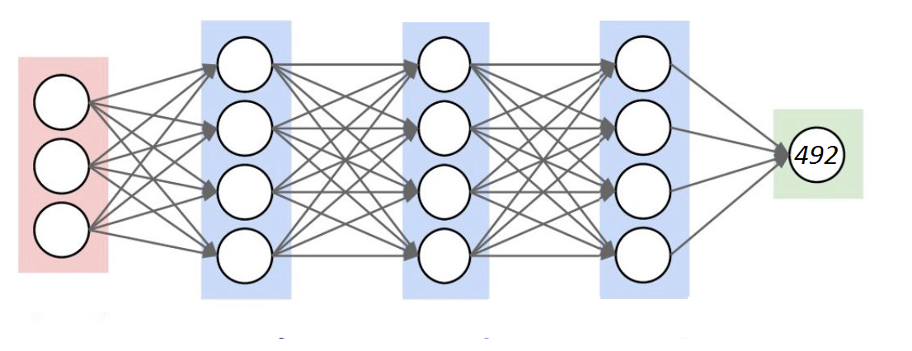</div>

## Codificatoare automate

 <u> DESCRIERE GENERALĂ</u>

<p style="font-size:20pt">
<br> &nbsp;&nbsp; <u>Codificatoarele automate</u> sunt modele de deep learning feedforward. Ele vin cu toate beneficiile şi flexibilitatea pe care le oferă <br> modelele de <u>deep learning</u>.
Deși este un concept simplu, aceste caracteristici (numite <u>codificări</u>) pot fi utilizate pentru: 
<br> &nbsp; &nbsp; &nbsp; &nbsp;&nbsp; &nbsp; &nbsp; &nbsp;  &nbsp; &nbsp; &nbsp; &nbsp; &nbsp; - <u>reducerea dimensiunii</u>. 
<br> &nbsp; &nbsp; &nbsp; &nbsp;&nbsp; &nbsp; &nbsp; &nbsp;  &nbsp; &nbsp; &nbsp; &nbsp; &nbsp;  - <u>detectarea anomaliilor</u>. 
<br> &nbsp; &nbsp; &nbsp; &nbsp;&nbsp; &nbsp; &nbsp; &nbsp; &nbsp; &nbsp; &nbsp; &nbsp; &nbsp; - <u>modelarea generativă</u>.
</p>

<div style="text-align:center;margin-top:0px;"></div>

## Codificatoare automate

 <u> DESCRIERE GENERALĂ</u>

<p style="font-size:20pt">
<br> &nbsp;&nbsp; <u>Codificatoarele automate</u> sunt modele de deep learning feedforward. Ele vin cu toate beneficiile şi flexibilitatea pe care le oferă <br> modelele de <u>deep learning</u>.
Deși este un concept simplu, aceste caracteristici (numite <u>codificări</u>) pot fi utilizate pentru: 
<br> &nbsp; &nbsp; &nbsp; &nbsp;&nbsp; &nbsp; &nbsp; &nbsp;  &nbsp; &nbsp; &nbsp; &nbsp; &nbsp; - <u>reducerea dimensiunii</u>. 
<br> &nbsp; &nbsp; &nbsp; &nbsp;&nbsp; &nbsp; &nbsp; &nbsp;  &nbsp; &nbsp; &nbsp; &nbsp; &nbsp;  - <u>detectarea anomaliilor</u>. 
<br> &nbsp; &nbsp; &nbsp; &nbsp;&nbsp; &nbsp; &nbsp; &nbsp; &nbsp; &nbsp; &nbsp; &nbsp; &nbsp; - <u>modelarea generativă</u>.
</p>

<div style="text-align:center;margin-top:0px;">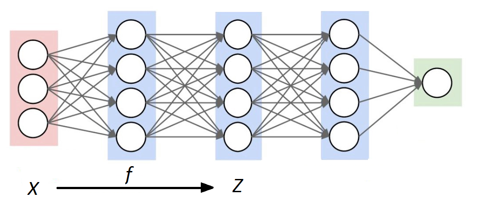</div>

## Codificatoare automate

 <u> DESCRIERE GENERALĂ</u>

<p style="font-size:20pt">
<br> &nbsp;&nbsp; <u>Codificatoarele automate</u> sunt modele de deep learning feedforward. Ele vin cu toate beneficiile şi flexibilitatea pe care le oferă <br> modelele de <u>deep learning</u>.
Deși este un concept simplu, aceste caracteristici (numite <u>codificări</u>) pot fi utilizate pentru: 
<br> &nbsp; &nbsp; &nbsp; &nbsp;&nbsp; &nbsp; &nbsp; &nbsp;  &nbsp; &nbsp; &nbsp; &nbsp; &nbsp; - <u>reducerea dimensiunii</u>. 
<br> &nbsp; &nbsp; &nbsp; &nbsp;&nbsp; &nbsp; &nbsp; &nbsp;  &nbsp; &nbsp; &nbsp; &nbsp; &nbsp;  - <u>detectarea anomaliilor</u>. 
<br> &nbsp; &nbsp; &nbsp; &nbsp;&nbsp; &nbsp; &nbsp; &nbsp; &nbsp; &nbsp; &nbsp; &nbsp; &nbsp; - <u>modelarea generativă</u>.
</p>

<div style="text-align:center;margin-top:0px;">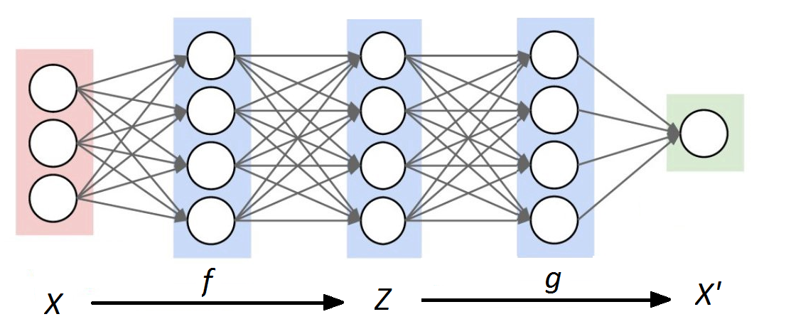</div>

## Codificatoare automate

<u> Tipuri de arhitecturi</u> <br>

 &nbsp;&nbsp; - Codificatoare automate incomplete<br>
 &nbsp;&nbsp; - Codificatoare automate stivă <br>
 &nbsp;&nbsp; - Codificatoare automate de reconstrucţie <br>

## Codificatoare automate

<u> Tipuri de arhitecturi</u> <br>

<u>  Codificatoare automate incomplete </u> <br>

<p style="font-size:20pt"> <br><br><br> &nbsp;&nbsp; Un autoencoder a cărui reprezentare internă <br> are o dimensionalitate mai mică decât datele de <br> intrare  este cunoscut sub numele de <br> <u>codificator automat incomplet</u>.  </p>

<div style="text-align:center;margin-top:-417px;margin-left:450px;">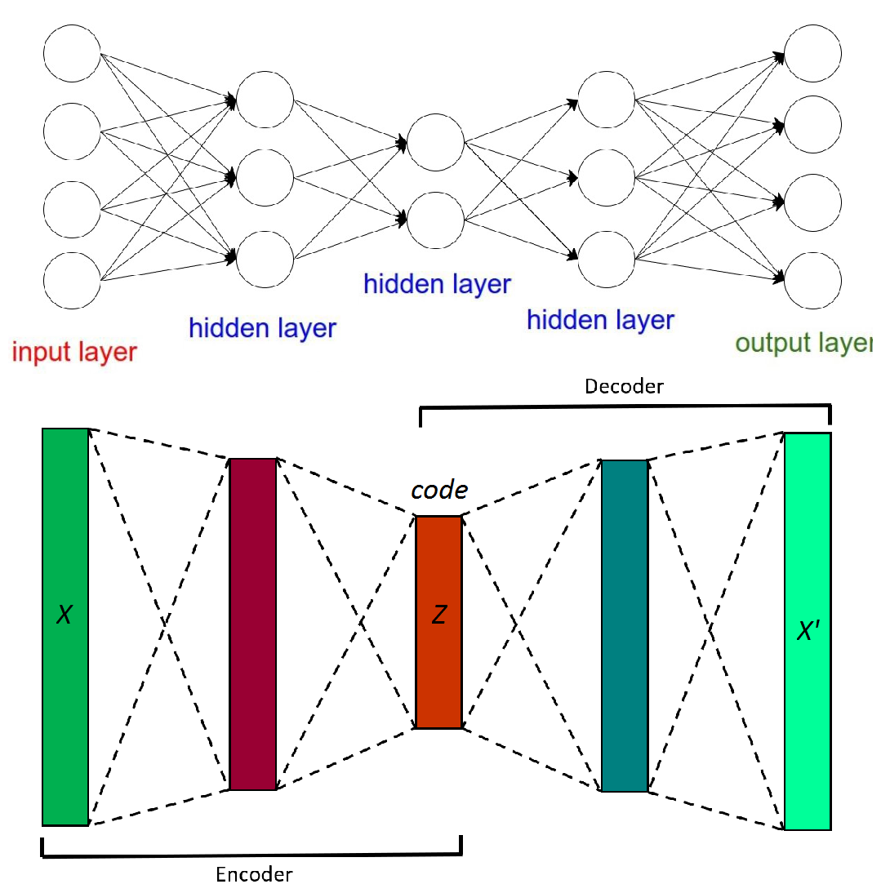</div>


## Codificatoare automate

<u> Tipuri de arhitecturi</u> <br>

<u>  Codificatoare automate stivă </u> <br>

<p style="font-size:20pt"><br><br><br>  &nbsp;&nbsp; Codificatoarele automate sunt adesea antrenate doar cu <br> un singur strat ascuns. Adăugarea de straturi  suplimentare <br> la un codificator automat poate avea avantaje. <br>&nbsp;&nbsp; Adăugarea de adâncime suplimentară poate permite codificărilor să <br> reprezinte relații mai complexe, neliniare, la un cost de calcul redus. </p>

<div style="text-align:center;margin-top:-300px;margin-left:760px;"></div>

## Codificatoare automate

<u> Tipuri de arhitecturi</u> <br>

<u>  Codificatoare automate stivă </u> <br>

<p style="font-size:20pt"><br><br><br>  &nbsp;&nbsp; Codificatoarele automate sunt adesea antrenate doar cu <br> un singur strat ascuns. Adăugarea de straturi  suplimentare <br> la un codificator automat poate avea avantaje. <br>&nbsp;&nbsp; Adăugarea de adâncime suplimentară poate permite codificărilor să <br> reprezinte relații mai complexe, neliniare, la un cost de calcul redus. </p>

<div style="text-align:center;margin-top:-300px;margin-left:760px;">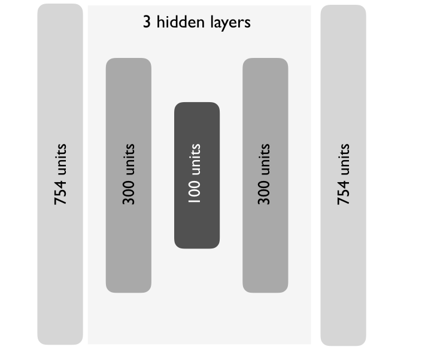</div>

## Codificatoare automate

<u> Tipuri de arhitecturi</u> <br>

<u>  Codificatoare automate stivă </u> <br>

<p style="font-size:20pt"><br><br><br>  &nbsp;&nbsp; Codificatoarele automate sunt adesea antrenate doar cu <br> un singur strat ascuns. Adăugarea de straturi  suplimentare <br> la un codificator automat poate avea avantaje. <br>&nbsp;&nbsp; Adăugarea de adâncime suplimentară poate permite codificărilor să <br> reprezinte relații mai complexe, neliniare, la un cost de calcul redus. </p>

<div style="text-align:center;margin-top:-300px;margin-left:760px;"></div>

## Codificatoare automate

<u> Tipuri de arhitecturi</u> <br>

<u>  Codificatoare automate de reconstrucţie</u> <br>

<p style="font-size:20pt"><br><br><br><br>  &nbsp;&nbsp;  Codificatorul automat de reconstrucţie  este antrenat să <br> reconstruiască datele de intrare dintr-o copie coruptă a acestora. <br>
&nbsp;&nbsp; Obiectivele unui codificator automat de reconstrucție sunt codificarea <br> intrărilor pentru a păstra caracteristicile  esențiale și anularea efectelelor <br> unui proces de corupție aplicat datelor de intrare ale codificatorului. 

</p>

<div style="text-align:center;margin-top:-350px;margin-left:760px;">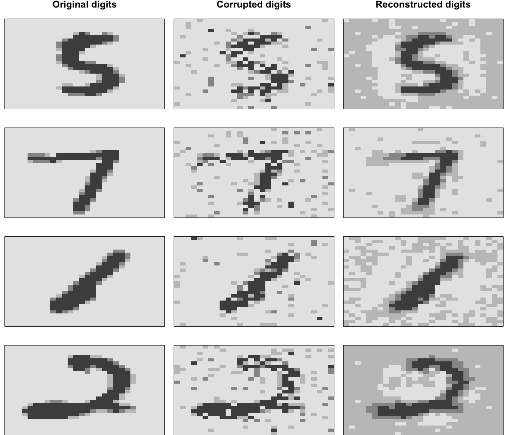</div>

## Codificatoare automate


<u> Etapele realizării unui codificator automat</u> <br>

1. Stabilirea setului de date <br>
2. Antrenarea codificatorului <br>
3. Determinarea caracteristicilor profunde(DF) <br>
4. Determinarea erorii de reconstrucție și reconstrucţia datelor iniţiale <br>

## Codificatoare automate

<u>PAS 1.</u> <br>
 <u>Stabilirea setului de date</u> <br>

```{r,message = FALSE,echo=FALSE,warning = FALSE,results='hide'}
#Pachetele pentru modelare
library(h2o)
library(dplyr)      #  pentru manipularea datelor
library(ggplot2)    # pentru vizualizarea datelor
# pentru montarea autoencoderelor
h2o.init()
# Import the USArrests dataset into H2O:
arrests <- h2o.importFile("https://s3.amazonaws.com/h2o-public-test-data/smalldata/pca_test/USArrests.csv")

```

```{r,message = FALSE,warning = FALSE}
arrests
#names(arrests)
```

```{r message=TRUE, warning=FALSE,echo=FALSE}
data<-data.matrix(arrests[,1:4])
#head(date)
```

<p style="font-size:25pt"><u>Vizualizarea relației dintre date</u> </p>
```{r,message = FALSE,warning = FALSE,echo= FALSE}
# Quick display of two cabapilities of GGally, to assess the distribution and correlation of variables 
library(GGally)
library(ggplot2) 
# Create data 
data <- data.frame(data) 
# Check correlations (as scatterplots), distribution and print corrleation coefficient 
ggpairs(data, title=" ") 

```

```{r,message = FALSE,echo=FALSE,warning = FALSE,results='hide'}
h2o.no_progress() # dezactivăm barele de progres
h2o.init(max_mem_size ="5g") # ini?ializăm instan?a H2O
```

## Codificatoare automate

<u>PAS 2.</u> <br>
 <u>Antrenarea codificatorului</u> <br>

```{r,message = FALSE,warning = FALSE,echo=TRUE}

# Vom împărți setul de date. 
arrests_splits <- h2o.splitFrame(data = arrests, ratios = 0.8, seed = 1234)
train <- arrests_splits[[1]]
valid <- arrests_splits[[2]]
arrests_splits
```

```{r,message = FALSE,warning = FALSE,echo=FALSE}
# Convert arrests features to an h2o input data set
features <- as.h2o(train)
```

```{r,message = FALSE,warning = FALSE,echo=TRUE}

autoencoder <- h2o.deeplearning(
  x = seq_along(features),
  training_frame = features,
  autoencoder = TRUE,
  distribution='gaussian',
  loss = "Quadratic",
  hidden = 2,
  activation = 'Tanh',
  sparse = TRUE ,
  average_activation = 0.7,
  )

autoencoder
```

## Codificatoare automate

<u>PAS 3.</u> <br>
 <u>Determinarea caracteristicilor profunde(DF)</u> <br>
 
```{r,message = FALSE,warning = FALSE,echo=TRUE}
# Extract the deep features
ae1_codings <- h2o.deepfeatures(autoencoder, train, layer = 1)
ae1_codings
summary(ae1_codings)
```

## Codificatoare automate

<u>PAS 4.</u> <br>
 <u>Determinarea erorii de reconstrucție și</u> <br>
&nbsp;&nbsp; &nbsp;&nbsp;&nbsp; <u> reconstrucţia datelor iniţiale </u> <br>
 
```{r,message = FALSE,warning = FALSE,echo=TRUE}
ae1_codings %>% 
    as.data.frame() %>% 
    tidyr::gather() %>%
    summarize(max_activation = max(value))

ae1_codings %>% 
    as.data.frame() %>% 
    tidyr::gather() %>%
    summarize(min_activation = min(value))

ae1_codings %>% 
    as.data.frame() %>% 
    tidyr::gather() %>%
    summarize(average_activation = mean(value))

perf <- h2o.performance(autoencoder)
perf

arrests
pred <- h2o.predict(autoencoder, newdata = arrests)
pred
```

## Codficatoare automate

<u> Vizualizarea reconstrucției</u><br>

<p style="font-size:20pt">
<br><br><br>  &nbsp;&nbsp; Cât de bine reconstituie un codificator automat datele de intrăre <br><br> &nbsp;&nbsp; <u>Mean Squared Error</u> ne oferă o evaluare generală a erorilor, dar <br> putem compara direct intrările şi ieşirile reconstruite.<br> &nbsp;&nbsp; Figura următoare ilustrează această comparaţie prin eşantionarea <br> unei serii de imagini de testare, prezicerea valorilor pixelilor reconstruiţi <br> pe baza unui codificator automat optim şi reprezentarea grafică a <br> cifrelor originale în raport cu cifrele reconstruite. <br> &nbsp;&nbsp; Obiectivul autoencoderului este de a capta caracteristicile <br> proeminente ale imaginilor în care orice diferenţă ar trebui să fie <br>  neglijabilă. Figura următoare ilustrează faptul că un codificator <br> automat face o treabă destul de bună în acest sens.  </p>

<div style="text-align:center;margin-top:-543px;margin-left:750px;">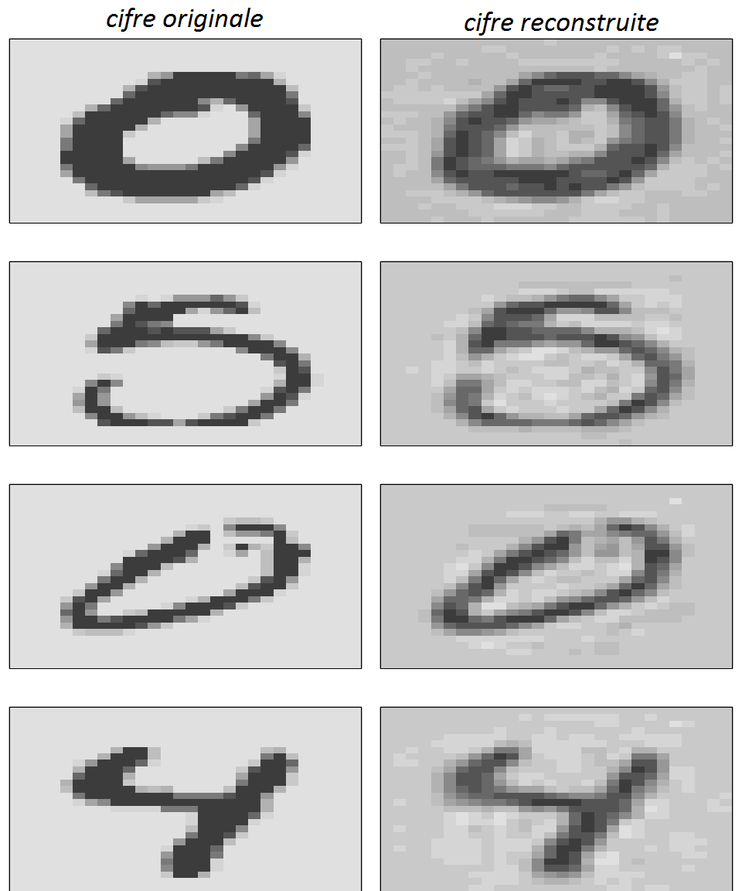</div>

## Codificatoare automate

<u> Comapararea PCA-ului cu un autoencoder</u>

<p style="font-size:20pt">&nbsp;&nbsp; Un codificator automat care foloseşte numai funcţii de activare liniară şi funcţia de pierdere este MSE se poate reduce la PCA. </p> 

<div style="text-align:center;margin-top:-0px;">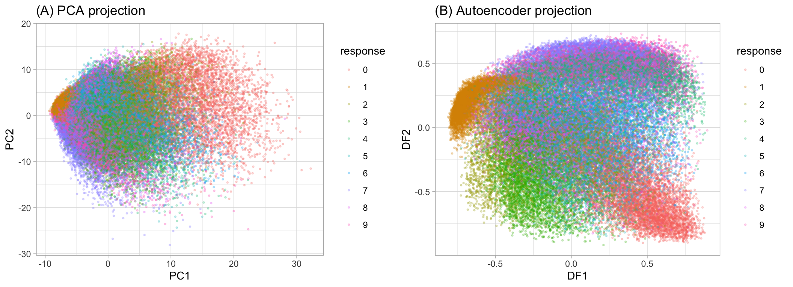</div>

## Codificatoare automate

<u> Detectarea anomaliilor</u>

<p style="font-size:20pt">&nbsp;&nbsp; Deoarece funcţia de pierdere a unui codificator automat măsoară eroare de reconstrucţie, atunci putem să extragem informaţii cu privire la identificarea acelor observaţii care au o rată foarte mare a erorii. Acele observaţii care au atribute ale caracteristicilor care diferă foarte multe de celelate caracteristici le vom considera a fi valori aberante.
</p> 

<div style="text-align:center;margin-top:-0px;margin-left:-740px"></div>

## SFÂRŞIT

<div style="text-align:center;margin-top:60px;"></div>
 